# GenMark-AI

> **뷰티 창업자를 위한 Recraft V4 Vector 기반 로고(CI·BI) 생성 및 FAISS를 통한 유사도 분석 서비스**
>
> 로고 생성부터 상표 충돌 가능성까지 한 번에 제공하는 통합 플랫폼


**팀 GenMark** · 생성형 AI융합서비스 개발자과정 실전 프로젝트 · 2026.07 ~ 2026.08

---

## 📑 목차

1. [프로젝트 소개](#1-프로젝트-소개)
2. [서비스 소개](#2-서비스-소개)
3. [프로젝트 기간](#3-프로젝트-기간)
4. [주요 기능](#4-주요-기능)
5. [기술 스택](#5-기술-스택)
6. [시스템 아키텍처](#6-시스템-아키텍처)
7. [서비스 흐름도](#7-서비스-흐름도)
8. [ER Diagram](#8-er-diagram)
9. [화면 구성](#9-화면-구성)
10. [팀원 소개](#10-팀원-소개)
11. [Trouble Shooting](#11-trouble-shooting)
12. [실행 방법](#12-실행-방법)
13. [유스케이스](#13-유스케이스)
14. [데이터베이스 & 배포](#14-데이터베이스--배포)
15. [CI / 테스트](#15-ci--테스트)
16. [문서](#16-문서)
17. [향후 개선 방향](#17-향후-개선-방향)

---

## 1. 프로젝트 소개

| 항목 | 내용 |
|---|---|
| **한 줄 소개** | 브랜드 정보만 입력하면 AI가 로고를 만들고, 국내 등록 상표(KIPRIS)와의 시각적 유사도까지 검증해주는 서비스 |
| **주요 사용자** | 뷰티 창업자 · 소규모 브랜드 운영자 |
| **핵심 가치** | 로고 제작 도구와 상표 검토 과정의 통합 — 외부 검토 없이 스스로 충돌 리스크 확인 |

### 📌 프로젝트 배경

- 화장품 책임판매업체는 2019년 15,707개 → 2023년 **31,524개**로 약 2배 증가, 그중 **80%가 10인 미만** 소규모 사업자
  *(출처: 식품의약품안전처 「2024년 화장품 산업 현황」)*
- 뷰티 시장 상표출원은 2024년 5,182건 → 2025년 **7,320건(+41.3%)**
  *(출처: 지식재산처 「'25년 산업재산권 출원 동향 분석」)*
- **상표법 제34조 제1항 제7호**에 따라 기존 등록 상표와 시각적으로 유사하면 등록이 제한될 수 있음
- 창업자는 로고 제작 이후 자신이 곧 겪게 될 상표 충돌 여부를 미리 알기 어렵다는 문제가 있음

### 🆚 유사 서비스와의 차별점

| 비교 대상 | 특징 | GenMark-AI |
|---|---|---|
| 캔바 등 범용 디자인 툴 | 로고 제작은 가능하지만 상표 유사도 검토 기능은 없음 | ✅ 생성 즉시 KIPRIS 등록상표 대비 AI 시각적 유사도 자동 분석 |
| 마크인포 등 상표 전문 서비스 | 로고 제작·상표 조사를 함께 제공하는 곳도 있음 | ✅ 이미지 임베딩(DINOv2+FAISS) 기반으로 생성된 로고 자체를 별도 요청 없이 즉시 비교 |
| 템플릿형 로고 메이커 | 기존 템플릿 조합·커스터마이징 중심 | ✅ 벡터(SVG) 기반 완전 생성 + 브라우저 내 요소별 편집 |

> 경쟁 서비스 목록은 계속 조사 중입니다 — 특정 서비스의 기능 유무를 단정하기보다, GenMark-AI가 실제로 하는 것(이미지 자체의 AI 시각적 유사도를 생성 직후 자동으로 보여주는 것)을 기준으로 비교했습니다.

---

## 2. 서비스 소개

### 🎨 로고 생성

- 설문 기반 심볼 / 워드마크 / 혼합형 / 레터마크 로고 자동 생성 (SVG + PNG)
- `Idempotency-Key` 기반 멱등 처리로 중복 생성 방지

### ✏️ 로고 편집

- 브라우저에서 SVG 요소 선택 · 이동 · 색상 · 크기 · 회전 · 투명도 · 삭제
- 언제든 원본으로 복원 가능

### 🔍 상표 유사도 검증

- DINOv2 임베딩 + FAISS 코사인 검색으로 **KIPRIS 등록 상표**와 비교
- 위험도 **SAFE / MODERATE / CAUTION** 판정과 유사 근거 해설(note) 제공
- 자체 생성 로고 벡터 저장소와 **통합 검색** (`KIPRIS` / `GENERATED` 출처 구분)

### 💼 브랜드킷

- 명함(앞/뒷면 PNG·SVG·PDF) 및 제품 썸네일 자동 생성
- 동일 스펙 재생성 방지(hash 기반 재사용)

---

## 3. 프로젝트 기간

| 항목 | 내용 |
|---|---|
| 프로젝트명 | GenMark-AI |
| 개발기간 | 2026.07 ~ 2026.08 |
| 개발인원 | 6명 |
| 프로젝트 소개 | 로고 생성부터 KIPRIS 상표 유사도 검증까지 한 번에 제공하는 뷰티 브랜드 통합 플랫폼 |

---

## 4. 주요 기능

| 기능 | 설명 |
|---|---|
| 🎨 **로고 생성 (CI/BI)** | 설문 기반 심볼 / 워드마크 / 혼합형 / 레터마크 생성 (SVG + PNG, `Idempotency-Key` 멱등 처리) |
| ✏️ **로고 편집기** | 브라우저 SVG 편집 — 요소 선택·이동·색상·크기·회전·투명도·삭제, 원본 복원 |
| 🔍 **상표 유사도 검증** | DINOv2 임베딩 + FAISS 코사인 검색으로 **KIPRIS 등록 상표**와 비교, 위험도 SAFE / MODERATE / CAUTION 판정 + 유사 근거 해설 |
| 🧬 **자체 로고 유사도** | 생성한 로고를 별도 벡터 저장소(`generation-data`)에 등록해 KIPRIS와 **통합 검색** (`KIPRIS` / `GENERATED` 출처 구분) |
| 💼 **브랜드킷** | 명함(앞/뒷면 PNG·SVG·PDF) 및 제품 썸네일 자동 생성, 동일 스펙 재생성 방지(hash 기반 재사용) |
| ⬇️ **다운로드** | PNG + SVG ZIP 아카이브, **첫 다운로드 시 만족도 설문 게이팅**(서버 강제) |
| 👤 **마이페이지** | 찜 · 다운로드 · 브랜드킷 · 크레딧 · 설문 이력 관리 |
| 📊 **관리자 대시보드** | 가입/생성/다운로드 분석 차트(인쇄 리포트), 회원·생성물 관리, 유사도 벡터화·1:1 비교 도구 |

> 크레딧은 가입(+2) · 설문(+1) 시 지급되며, 현재 생성/다운로드는 무료로 제공됩니다(`CreditFreeFlowTest` 보장).

---

## 5. 기술 스택

### Frontend


- React 19 + TypeScript SPA (라우팅·상태관리 자체 구현, 외부 상태 라이브러리 최소화)
- 브라우저 SVG 편집기 (DOM 기반 요소 선택·변환, 보안 살균 sanitize 내장)
- Vite dev 프록시(`/api`, `/uploads` → Spring Boot), 정적 빌드는 Nginx가 서빙

### Backend


-6DB33F?style=flat-square&logo=springsecurity&logoColor=white)


- REST API(`/api/v1/**`) · 비동기 작업 큐(`QUEUED→RUNNING→SUCCEEDED/FAILED`) · 폴링 인터페이스
- 소셜로그인(Google ID Token / Kakao Access Token) 검증 후 JWT access+refresh 발급·rotate
- 멱등키 기반 생성 중복 방지, 설문 게이팅 등 서버 주도 정책 강제
- Docker 기반 백엔드·AI 서버·DB 컨테이너 설계, 환경별(local/dev/prod) docker-compose 구성
- 네이버클라우드 Public/Private 2서버 분리 배포, Nginx 리버스 프록시·SSL·무중단 재배포 운영

### AI Server


-EE4C2C?style=flat-square&logo=pytorch&logoColor=white)
-0091DA?style=flat-square&logo=meta&logoColor=white)

- **Upstage Solar Pro 4**: 사용자 입력 구조화 → 로고 프롬프트 변환
- **Recraft V4 Vector**(OpenRouter): 로고 SVG 생성, 배경·잡점 자동 제거
- **DINOv2-base**(768차원, L2 정규화) + **FAISS**: KIPRIS 등록 상표 7,423건 벡터 DB 코사인 유사도 검색
- **Gemini / FLUX.2-pro**: 유사 매치 해설 note 생성, 제품 썸네일 목업 합성

### Database & Infra


-03C75A?style=flat-square)

---

## 6. 시스템 아키텍처

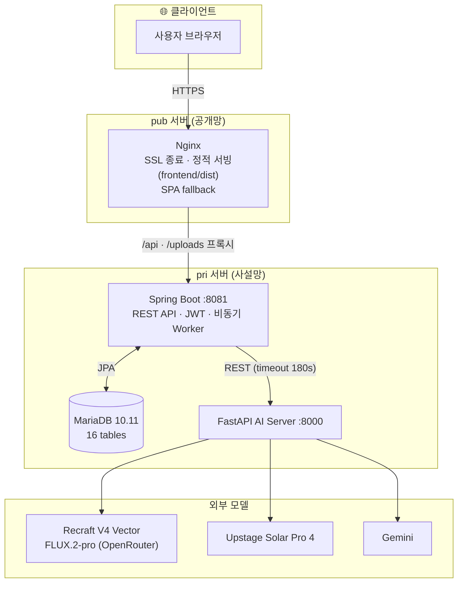

자산 저장소 4계층 분리: `/data/public_data`(PNG 공개) · `/data/private_data`(SVG·PDF 비공개) · `trademark-data`(KIPRIS 원본, 읽기전용) · `generation-data`(자체 로고 벡터, 읽기·쓰기)

---

## 7. 서비스 흐름도

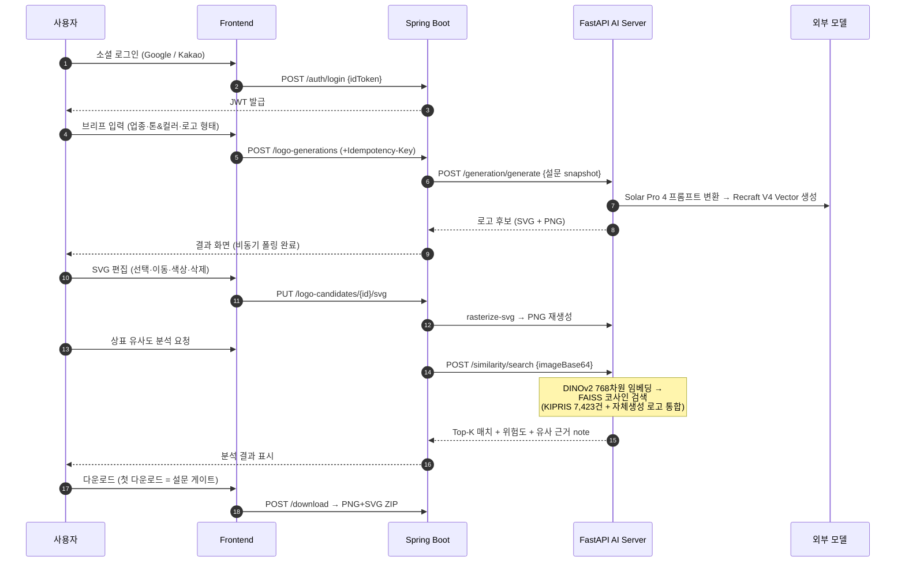

**유사도 점수 체계** — 코사인 유사도 실측 앵커 `(0.42→0, 0.80→30, 0.89→60, 1.00→100)` 구간 선형보간으로 0~100점 환산, `<30 SAFE · <60 MODERATE · ≥60 CAUTION`

---

## 8. ER Diagram

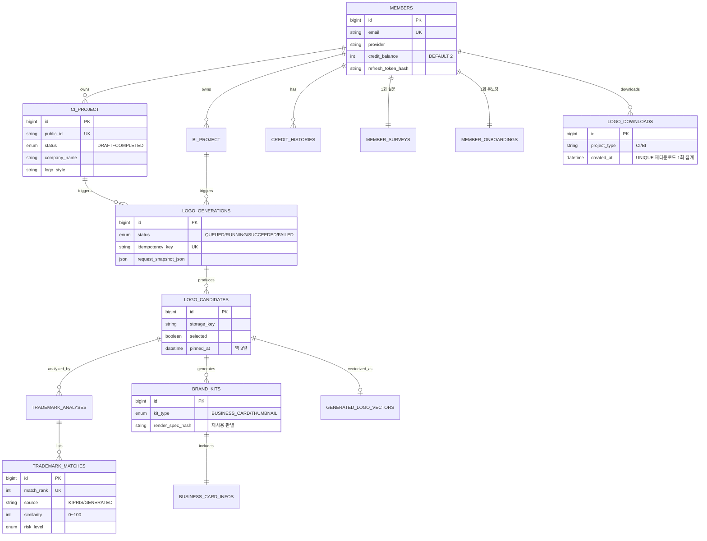

> 전체 16개 테이블 — 입문용 해설은 [`docs/database-table-guide-easy.md`](docs/database-table-guide-easy.md)

---

## 9. 화면 구성

| 홈 | CI·BI 로고 스타일 선택 |
|---|---|
| 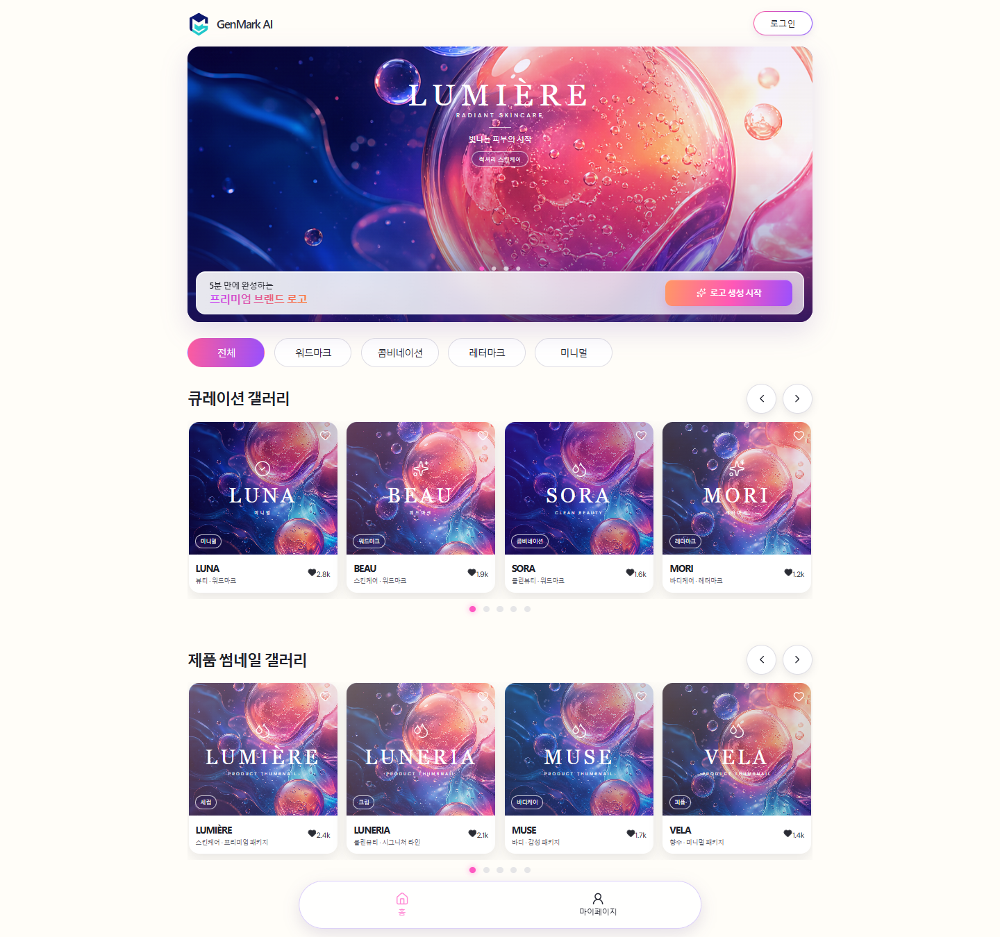 | 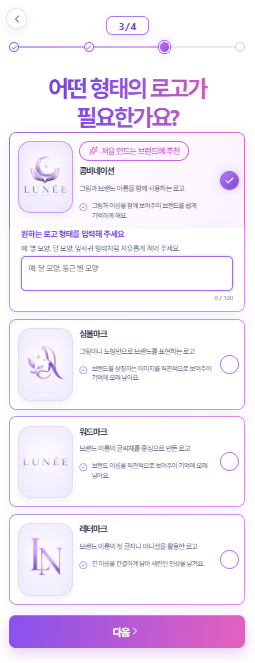 |
| **로고 생성 결과** | **상표 유사도 분석 결과** |
| 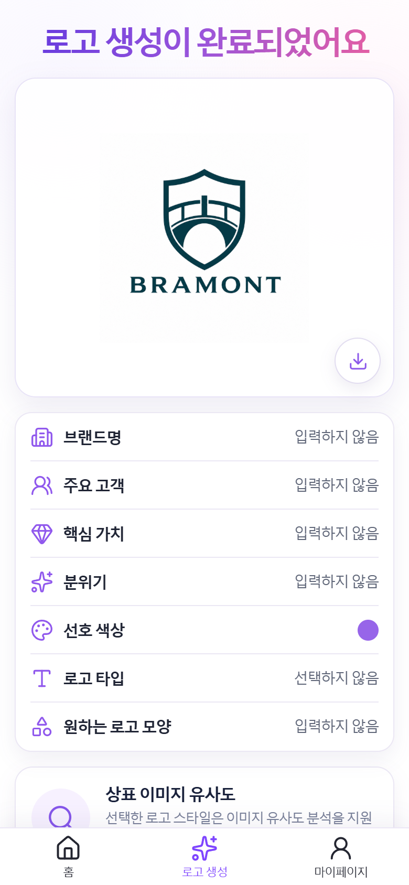 | 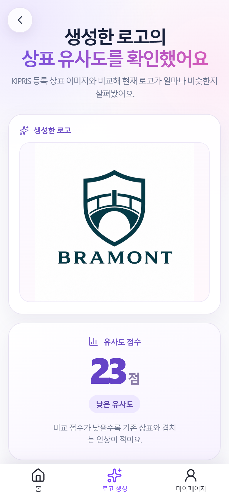 |
| **SVG 로고 편집기** | **브랜드킷 (명함·제품 썸네일)** |
| 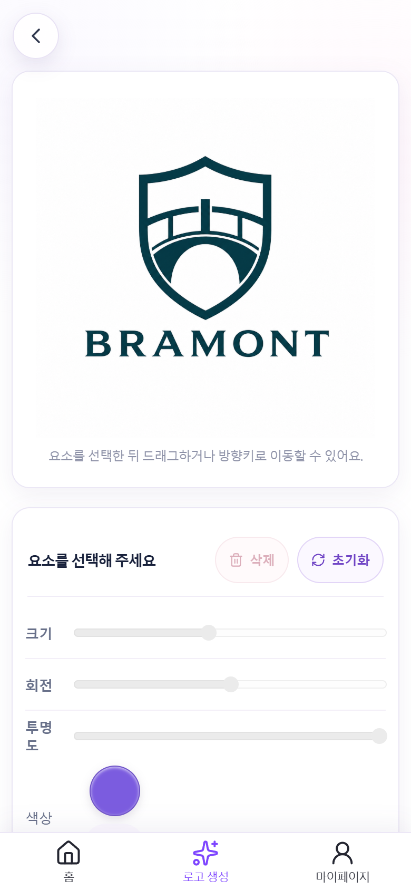 | 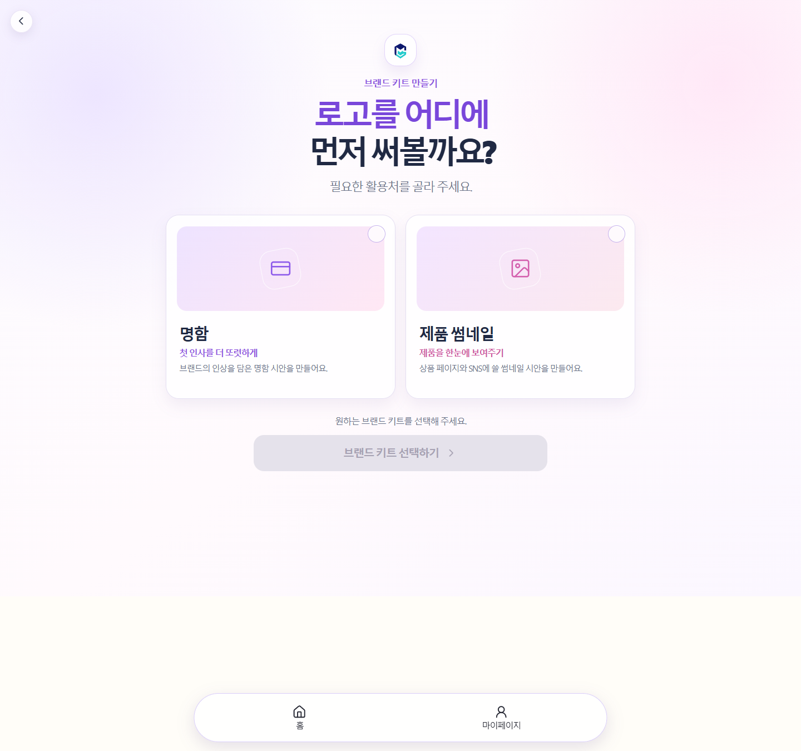 |
| **마이페이지** | **관리자 대시보드** |
| 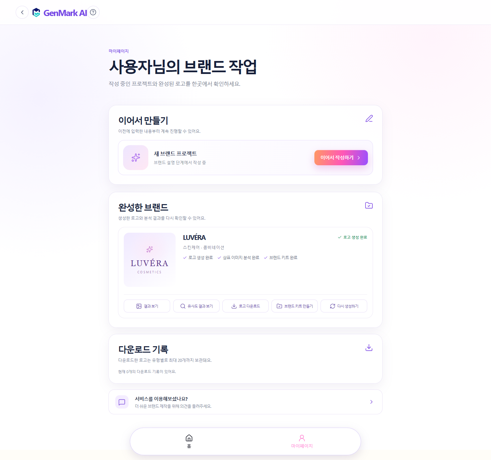 | 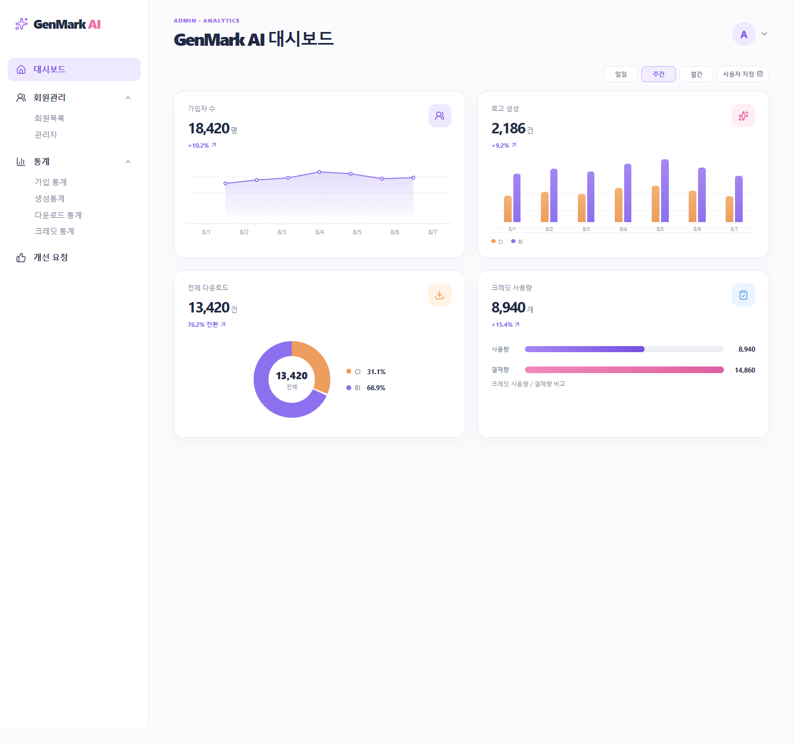 |

---

## 10. 팀원 소개

| 이름 | 담당 | GitHub |
|---|---|---|
| **김명은** 팀장 | Back-End · Docker/클라우드 설계 · 서버 인프라 | [@mgim14636-art](https://github.com/mgim14636-art) |
| **남현욱** | PM · AI 프롬프팅 | [@wook153462](https://github.com/wook153462) |
| **서성찬** | Front-end · AI 프롬프팅 | [@seongchan](https://github.com/seongchan) |
| **한창수** | Back-end · AI 프롬프팅 | [@chsngsoo2609](https://github.com/chsngsoo2609) |
| **정혜리** | AI-Modeling · Front-End | [@HYERI-02](https://github.com/HYERI-02) |
| **김호근** | Front-End · DB | [@kim4646](https://github.com/kim4646) |

---

## 11. Trouble Shooting

### ① 무관한 로고가 동일 상표보다 높은 점수를 받던 문제

- **문제** — 쿼리 임베딩마다 Z-score 기준이 달라져 점수 일관성이 없었음
- **원인** — 검색 풀 분포에 의존하는 통계 기반 정규화 방식
- **해결** — 코사인 유사도 **실측 기준 0~100점 체계로 재설계** (앵커 4구간 선형보간, `similarity_service._to_score`)

### ② 설문 없이 다운로드를 우회 호출할 수 있던 문제

- **문제** — 설문을 완료하지 않아도 다운로드 API를 직접 호출하면 로고를 받을 수 있었음
- **원인** — 설문 검사가 프론트엔드에만 존재 → 브라우저 조작으로 우회 가능
- **해결** — 백엔드에서 설문 완료 여부를 직접 검증(`SURVEY_REQUIRED` 403), 재다운로드에도 동일 적용

### ③ 편집한 로고인데 원본이 다운로드되던 버그

- **문제** — SVG 편집 후 ZIP 다운로드 시 항상 최초 원본 SVG가 담김
- **원인** — 아카이브가 최초 storage_key에 고정
- **해결** — 매 다운로드 시 현재 revision의 편집본으로 **재아카이브**(`svgRevision` 메타데이터 추적), 재다운로드 1회 집계 유지

### ④ 결과 화면 로고 썸네일이 늘어나던 문제

- **문제** — 결과/편집 화면의 로고 비율이 깨져 보임
- **원인** — SVG 원본의 `preserveAspectRatio="none"`이 그대로 렌더링됨
- **해결** — 편집 파이프라인 전체에 `xMidYMid meet` 강제 + 편집 저장 후 candidate 재조회로 최신 storageKey 동기화

### ⑤ 자체 생성 로고가 KIPRIS 출원번호로 표시되던 문제

- **문제** — 우리가 만든 로고와의 유사 매치에 존재하지 않는 KIPRIS 출원번호가 노출
- **원인** — 두 벡터 인덱스(KIPRIS / 자체생성)의 매치가 출처 구분 없이 섞여 저장됨
- **해결** — 매치에 `source ENUM('KIPRIS','GENERATED')` 추가(V32·V33), GENERATED 매치는 DB에서 회사명/브랜드명 역조회하여 표시

---

## 12. 실행 방법

### 0. 요구사항
Docker + Docker Compose · Node.js 20+ (프론트 빌드) · JDK 17/Maven · Python 3.11 (개별 실행 시)

### 1. 환경 변수 설정
```bash
cp .env.example .env
```
주요 항목: `DB_HOST/DB_NAME/DB_APP_USER/DB_APP_PASSWORD`, `JWT_SECRET`, `GOOGLE_CLIENT_ID`, `KAKAO_REST_API_KEY`, `OPENROUTER_API_KEY`

### 2. 프론트엔드 빌드
```bash
cd frontend && npm ci && npm run build && cd ..
```

### 3. 로컬 통합 실행 (권장)
```bash
docker compose -f docker-compose.local.yml up -d --build

# 일회용 로컬 DB가 필요하면 (포트 3307)
docker compose --profile local-db up -d local-db
```
로컬 프로필은 fake OAuth(`AUTH_FAKE_PROVIDER_ENABLED=true`)와 CORS(localhost:5173)가 활성화됩니다.

### 4. 접속 URL
| 대상 | URL |
|---|---|
| Nginx Web Gateway | http://localhost |
| Spring Boot Direct | http://localhost:8081 |
| FastAPI Swagger UI | http://localhost:8000/docs |
| 일회용 MariaDB | `localhost:3307` (genmark_user / genmark_pass) |

### 5. 개별 실행
```bash
cd backend   && mvn spring-boot:run          # 포트 8081 (local profile)
cd ai-server && pip install -r requirements.txt && uvicorn app.main:app --port 8000
cd frontend  && npm run dev                  # Vite dev 서버 (/api 프록시)
```

---

## 13. 유스케이스

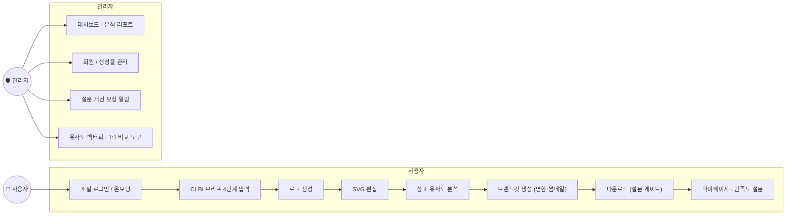

---

## 14. 데이터베이스 & 배포

- 런타임 Flyway 비활성(`ddl-auto=validate`) — 로컬은 `database/schema.sql` 스냅샷, 운영은 `database/migration/V1~V33` 순차 적용
- 운영 반영은 GitHub Actions **db-migrate.yml**(수동 dispatch, environment 승인)이 Flyway 12로 수행
- 최근 마이그레이션: `V32` generated_logo_vectors(자체 로고 벡터 bookkeeping), `V33` trademark_matches.source(KIPRIS/GENERATED)

**NCP 2서버 분리 배포**

| 서버 | 명령 | 구성 |
|---|---|---|
| **pub** | `docker compose --profile pub up -d` | Nginx만 — 443 SSL 종료 후 pri 사설망으로 `/api`, `/uploads` 프록시 |
| **pri** | `docker compose --profile pri up -d` | backend + ai-server + MariaDB(외부 노출 차단) |

개별 재배포: `infra/scripts/deploy-backend.sh` · `deploy-ai-server.sh` · 업로드 영속화: 호스트 `/data/public_data|private_data/*`

---

## 15. CI / 테스트

| 워크플로 | 내용 |
|---|---|
| `.github/workflows/db-migrate.yml` | 운영 DB Flyway 마이그레이트 게이트 (수동 실행) |
| `.github/workflows/ai-server-ci.yml` | push/PR 시 ai-server pytest |

```bash
cd backend    && mvn test       # 서비스/클라이언트/컨트롤러 단위 테스트 34종 (Mockito)
cd ai-server  && pytest
cd frontend   && npm run build  # tsc 타입검사 + Vite 빌드
```

---

## 16. 문서

- [`docs/ai-team-trademark-similarity-requirements.md`](docs/ai-team-trademark-similarity-requirements.md) — 상표 유사도 AI 요구사항 정의서
- [`docs/api/ai-api.md`](docs/api/ai-api.md) — FastAPI AI 서버 API 명세
- [`docs/frontend-backend-handoff.md`](docs/frontend-backend-handoff.md) — FE↔BE REST API 계약
- [`docs/2026-08-16_GENMARK_CONNECTION_AI_DB_HANDOFF.md`](docs/2026-08-16_GENMARK_CONNECTION_AI_DB_HANDOFF.md) — 화면·API·DB·AI 전체 연결 점검
- [`docs/postman/`](docs/postman/) — Postman 컬렉션 + Newman 검증 결과

---

## 17. 향후 개선 방향

- **크레딧 소비 활성화** — `GENERATE`/`DOWNLOAD` 차감 로직 활성화 및 결제 연동 (지급 체계는 이미 구현)
- **KIPRIS 인덱스 확장** — 현 7,423건 → 전 산업권 확대, 주기적 재색인 파이프라인
- **상표 출원 연계** — 분석 결과 기반 출원 서류 초안 지원
- **워드마크 고도화** — 다국어 타이포그래피·커스텀 폰트 대응 확대
- **제품 썸네일 카테고리 확대** — 스킨케어 외 카테고리 목업 템플릿 추가
