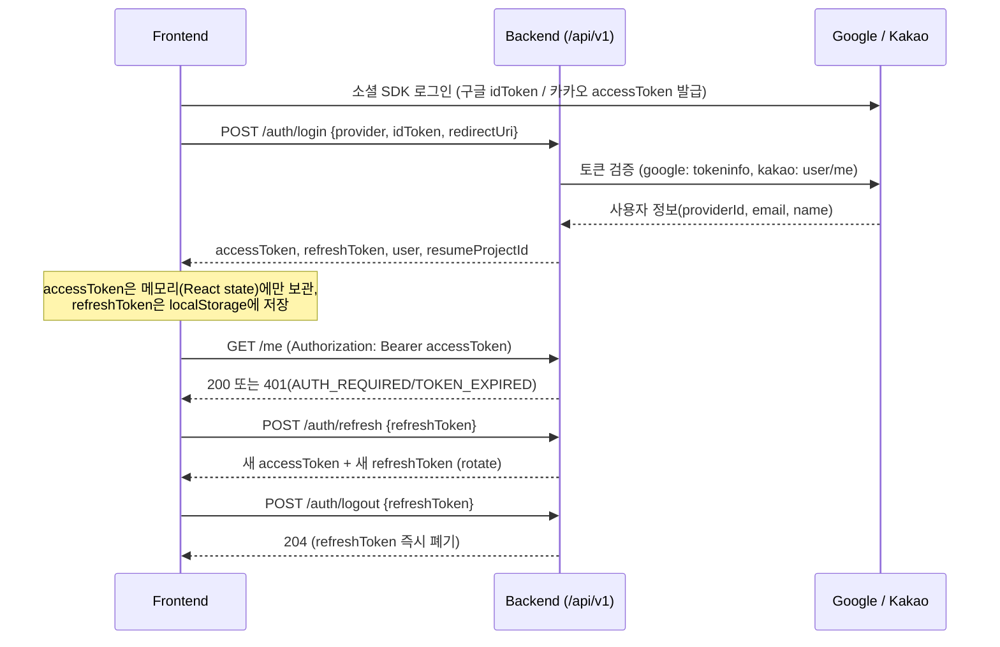

# 인증(로그인) 백엔드 ↔ 프론트 연동 가이드

frontend/docs/API_SPEC.md 5.1(인증)을 기준으로 구현한 백엔드의 실제 동작을 정리한 문서다.
frontend/src/lib/tokenStorage.ts의 주석이 참조하는 `docs/AUTH_INTEGRATION.md §6`이 바로 이 문서의
6장이다. 프론트가 `authApi.ts`를 실제로 연결할 때 이 문서와 API_SPEC.md를 같이 보면 된다.

- 문서 버전: `v1.0.0`
- 구현 범위: `POST /api/v1/auth/login`, `POST /api/v1/auth/refresh`, `POST /api/v1/auth/logout`, `GET /api/v1/me`
- 관련 프론트 파일: `frontend/src/lib/authApi.ts`, `googleAuth.ts`, `kakaoAuth.ts`, `tokenStorage.ts`
- 관련 백엔드 소스: `backend/src/main/java/com/genmark/ai/{web,oauth,security,service}`

## 1. 전체 흐름



## 2. 엔드포인트

모든 성공 응답은 `{"data": {...}, "meta": {"requestId","timestamp"}}`,
모든 오류 응답은 `{"error": {"code","message","details","requestId"}}` 포맷이다 (API_SPEC.md 2.2/2.3 그대로).

### `POST /api/v1/auth/login`

```json
// request
{ "provider": "kakao", "idToken": "...", "redirectUri": "https://app.example.com/auth/callback" }
```

```json
// 200 response (실제 curl 테스트 결과)
{
  "data": {
    "accessToken": "eyJhbGciOi...",
    "refreshToken": "rt_0_Ke3YyMB0W77uw7W-98mA9wnEFxJgrYZjcLS1Y28rg",
    "expiresIn": 3600,
    "user": {
      "id": "8",
      "email": "fake+metest2@genmark.local",
      "name": "Fake User metest2",
      "provider": "fake",
      "isFirstLogin": true
    },
    "resumeProjectId": null
  },
  "meta": { "requestId": "req_...", "timestamp": "2026-08-05T07:22:27Z" }
}
```

- `user.id`는 DB PK(BIGINT)를 문자열로 변환한 값이다 (`UserSummary.id: string`과 타입 일치).
- `isFirstLogin`은 "이 provider+providerId 조합으로 회원 레코드가 이번 호출에서 새로 생성됐는가"로 판단한다.
  같은 사람이 구글/카카오를 각각 처음 쓰면 그때마다 `true`가 된다(하나의 사람 = 하나의 계정이 아니다, 4장 참고).
- `resumeProjectId`는 **항상 `null`**이다. `projects` 테이블에 아직 API_SPEC.md의 프로젝트 상태(`status`, DRAFT/ONBOARDING/...)
  필드가 없어서 "이어서 진행할 프로젝트"를 판별할 수 없다. 프로젝트 도메인이 구현되면 채워 넣어야 한다.

### `POST /api/v1/auth/refresh`

```json
// request
{ "refreshToken": "rt_..." }
```

```json
// 200 response
{ "data": { "accessToken": "eyJ...", "refreshToken": "rt_new...", "expiresIn": 3600 }, "meta": {...} }
```

호출할 때마다 refreshToken이 새로 발급되고(rotate) 기존 값은 즉시 무효화된다. 이미 사용된
refreshToken을 다시 보내면 `401 TOKEN_EXPIRED`가 온다 — 재사용 감지도 겸한다.

### `POST /api/v1/auth/logout`

```json
// request
{ "refreshToken": "rt_..." }
```

응답은 `204 No Content`. 회원의 refreshToken 해시를 즉시 삭제해서 재사용을 막는다.

### `GET /api/v1/me`

`Authorization: Bearer {accessToken}` 헤더 필요. 응답:

```json
{ "data": { "user": { "id": "8", "email": "...", "name": "...", "provider": "fake", "isFirstLogin": false }, "resumeProjectId": null }, "meta": {...} }
```

토큰이 없거나 잘못됐으면 `401 AUTH_REQUIRED`, 만료됐으면 `401 TOKEN_EXPIRED`.

## 3. 액세스 토큰(JWT) 구조

- 알고리즘: HS256, 시크릿은 `JWT_SECRET` 환경변수 (`jwt.secret`).
- claims: `sub`(memberId), `email`, `role`, `iat`, `exp`.
- 만료: `JWT_ACCESS_TOKEN_EXPIRATION_SECONDS` (기본 3600초).
- 리프레시 토큰은 JWT가 아니라 `rt_`로 시작하는 opaque random 문자열이다. DB에는 원문이 아니라
  SHA-256 해시(`members.refresh_token_hash`)만 저장한다. 유효기간은 `JWT_REFRESH_TOKEN_EXPIRATION_DAYS`(기본 14일).
- 회원당 refreshToken은 1개만 유효하다(단일 세션). 다른 기기에서 다시 로그인하면 이전 refreshToken은 못 쓰게 된다.
  "여러 기기 동시 로그인" 지원이 필요해지면 `members` 1:1 컬럼 대신 별도 `refresh_tokens` 테이블로 바꿔야 한다.

## 4. provider별 토큰 검증 방식 (중요 — 필드명과 실제 의미가 다르다)

`LoginRequest.idToken` 필드 이름은 고정이지만, provider에 따라 실제로 보내는 값의 성격이 다르다.
`frontend/src/lib/googleAuth.ts`, `kakaoAuth.ts`의 주석에 이미 명시돼 있고, 백엔드도 그 전제로 구현했다.

| provider | 프론트가 `idToken`에 담아 보내는 값 | 백엔드 검증 방법 |
|---|---|---|
| `google` | Google Identity Services가 발급한 **ID Token**(JWT `credential`) | `GET https://oauth2.googleapis.com/tokeninfo?id_token=...` 호출, `aud`가 `GOOGLE_CLIENT_ID`와 일치하는지 확인 |
| `kakao` | `Kakao.Auth.login()`이 돌려주는 **OAuth Access Token** (OIDC id_token 아님) | `GET https://kapi.kakao.com/v2/user/me`를 `Authorization: Bearer {token}`으로 호출 |
| `fake` | 임의의 문자열(사용자 식별자로 그대로 사용) | 로컬 개발 전용. `AUTH_FAKE_PROVIDER_ENABLED=true`일 때만 동작 (운영은 기본 `false`) |

- `GOOGLE_CLIENT_ID`가 비어 있으면(로컬 초기 셋업) `aud` 검사를 건너뛴다. 실제 값이 설정되면 자동으로 검사가 활성화된다.
- 신규 provider를 추가하려면 `com.genmark.ai.oauth.OAuthVerifier`를 구현하고 `@Component`로 등록하면
  `OAuthVerifierResolver`가 자동으로 인식한다 (provider 이름은 `provider()` 메서드 반환값 기준).

### fake provider로 로컬 테스트하기

구글/카카오 앱 키 없이도 전체 로그인 플로우를 확인할 수 있다.

```bash
curl -X POST http://localhost:18080/api/v1/auth/login \
  -H "Content-Type: application/json" \
  -d '{"provider":"fake","idToken":"my-test-id"}'
```

`fake+my-test-id@genmark.local` 이메일로 회원이 생성/조회된다. **운영 환경에서는 반드시 비활성화(`AUTH_FAKE_PROVIDER_ENABLED=false`)해야 한다.**

## 5. 오류 코드

API_SPEC.md 8장 표에 정의된 코드 외에, 로그인 처리에 필요해서 추가한 코드가 있다.

| 코드 | HTTP | 의미 | 비고 |
|---|---|---|---|
| `VALIDATION_ERROR` | 422 | 요청 필드 검증 실패 | API_SPEC.md 정의 |
| `AUTH_REQUIRED` | 401 | 토큰 없음/무효 | API_SPEC.md 정의 |
| `TOKEN_EXPIRED` | 401 | 액세스/리프레시 토큰 만료 또는 이미 사용된(rotate된) 리프레시 토큰 | API_SPEC.md 정의 |
| `OAUTH_VERIFICATION_FAILED` | 401 | 구글/카카오 토큰 검증 실패 | **추가된 코드** |
| `PROVIDER_NOT_SUPPORTED` | 400 | `provider` 값이 kakao/google/fake가 아니거나, fake가 비활성화됨 | **추가된 코드** |
| `INTERNAL_ERROR` | 500 | 예상 못한 서버 오류 | **추가된 코드** |

## 6. 토큰 저장 및 보안 정책

`frontend/src/lib/tokenStorage.ts`가 이미 이 정책을 전제로 작성돼 있다.

- **accessToken은 어디에도 영속 저장하지 않는다.** React state 등 메모리에만 두고, 새로고침하면
  `refreshToken`으로 새 accessToken을 다시 받아온다. XSS로 스크립트가 실행되더라도 accessToken이
  `localStorage`/`sessionStorage`에 남아있지 않게 하기 위함이다.
- **refreshToken은 `localStorage`에 저장**한다(`genmark.refreshToken` 키). opaque random 값이라 그 자체로는
  사용자 정보를 노출하지 않지만, 탈취되면 재발급이 가능하므로 아래 rotate 정책으로 위험을 줄인다.
- **refreshToken은 사용할 때마다 rotate된다.** `/auth/refresh` 호출 시 새 refreshToken을 받고 이전 값은
  서버에서 즉시 폐기된다. 탈취된 옛 토큰으로 재사용을 시도하면 `TOKEN_EXPIRED`로 막힌다.
- 서버는 refreshToken 원문을 저장하지 않고 SHA-256 해시만 저장한다 (`TokenHasher.sha256Hex`).
- `/api/v1/**`는 CSRF 보호를 사용하지 않는다(세션 쿠키 기반이 아니라 Bearer 토큰 기반이라 불필요).

## 7. DB 스키마 변경

`database/migration/V4__add_oauth_login.sql`에서 `members` 테이블에 아래 컬럼을 추가했다
(로컬 dev DB에는 이미 수동으로 반영돼 있던 걸 정식 마이그레이션으로 문서화한 것 — schema.sql도 함께 갱신).

| 컬럼 | 타입 | 설명 |
|---|---|---|
| `password` | VARCHAR(255) NULL | 소셜 로그인 회원은 비밀번호가 없다 (기존엔 NOT NULL이었음) |
| `provider` | VARCHAR(20) NOT NULL DEFAULT 'local' | `local` / `google` / `kakao` / `fake` |
| `provider_id` | VARCHAR(100) NULL | provider 쪽 고유 사용자 ID |
| `refresh_token_hash` | VARCHAR(128) NULL | 리프레시 토큰 SHA-256 해시 |
| `refresh_token_expires_at` | DATETIME NULL | 리프레시 토큰 만료 시각 |

유니크 제약 `uq_member_provider_provider_id (provider, provider_id)`로 같은 provider 안에서 계정 중복 가입을 막는다.

### 알려진 제한사항: 이메일 충돌

`members.email`은 여전히 `UNIQUE NOT NULL`이다. 아래 두 경우엔 실제 이메일 대신
`{provider}+{providerId}@oauth.genmark.local` 형태의 합성 이메일을 저장한다.

1. 카카오 로그인에서 사용자가 이메일 제공에 동의하지 않은 경우 (`kakao_account.email`이 없음)
2. 같은 이메일로 이미 다른 provider 계정이 존재하는 경우 (예: 구글로 가입한 이메일과 같은 이메일의 카카오 계정)

즉 **"같은 사람이 구글/카카오를 둘 다 쓰면 서로 다른 계정 2개가 생긴다."** 계정 연동(하나의 사람 = 하나의 계정)은
Phase 1 범위 밖이며, 필요해지면 별도 "계정 연결" 플로우(로그인 상태에서 다른 provider 추가 연결) 설계가 필요하다.

## 8. 환경변수

`.env.example` 참고. 로컬은 기본값만으로 fake 로그인이 바로 동작한다.

| 변수 | 기본값(local) | 설명 |
|---|---|---|
| `JWT_SECRET` | 개발용 문자열 | 운영 배포 전 `openssl rand -base64 48` 등으로 교체 필수 |
| `JWT_ACCESS_TOKEN_EXPIRATION_SECONDS` | 3600 | 액세스 토큰 수명(초) |
| `JWT_REFRESH_TOKEN_EXPIRATION_DAYS` | 14 | 리프레시 토큰 수명(일) |
| `GOOGLE_CLIENT_ID` | (빈 값) | 비어있으면 aud 검사 생략. 프론트 `VITE_GOOGLE_CLIENT_ID`와 같은 값이어야 함 |
| `KAKAO_REST_API_KEY` | (빈 값) | 현재 검증 로직에서는 실사용 안 함(accessToken 자체가 검증 대상). 참고용으로 남겨둠 |
| `AUTH_FAKE_PROVIDER_ENABLED` | `true`(local) / `false`(prod) | fake provider 허용 여부 |

## 9. 구글/카카오 클라이언트 ID 발급 방법

우리 구현 방식(프론트: Google Identity Services 팝업 / Kakao JS SDK, 백엔드: tokeninfo·user/me 검증) 기준으로
실제로 어떤 키를 어디서 받아서 어디에 넣어야 하는지 정리한다. 아래 값들을 채우기 전까지는
`fake` provider로 로그인 플로우를 그대로 테스트할 수 있다 (4장 참고).

### 9.1 구글

1. https://console.cloud.google.com 접속 → 프로젝트 생성(또는 기존 프로젝트 선택).
2. 좌측 메뉴 **APIs & Services → OAuth consent screen**
   - User Type: `External` 선택 (일반 구글 계정으로 로그인시킬 거라면).
   - 앱 이름, 지원 이메일 등 필수 항목 입력 후 저장.
   - Scopes는 기본 `email`, `profile`, `openid`만 있으면 된다 (민감/제한 스코프 아니라서 별도 심사 없이 게시 가능).
   - 앱이 "Testing" 상태인 동안에는 여기서 **Test users**로 추가한 구글 계정만 로그인이 된다.
     실제 서비스로 열려면 **Publish App**을 눌러 "In production"으로 전환해야 한다(민감 스코프가 없으므로 구글의 별도 검수 없이 전환 가능).
3. 좌측 메뉴 **APIs & Services → Credentials → + Create Credentials → OAuth client ID**
   - Application type: **Web application**
   - Authorized JavaScript origins에 프론트가 실제로 뜨는 origin을 추가:
     - 로컬 개발: `http://localhost:5173` (Vite 기본 포트, 실제 포트에 맞게)
     - 배포 도메인: `https://your-domain.com`
   - Authorized redirect URI는 비워둬도 된다 (GSI 팝업 방식은 리다이렉트를 쓰지 않는다).
   - 생성하면 `xxxxxxxx.apps.googleusercontent.com` 형태의 **Client ID**가 나온다. **Client Secret은 필요 없다**
     (백엔드가 id_token을 프론트에서 받아 tokeninfo로 검증하는 방식이라 secret을 쓰는 서버 사이드 교환이 없다).
4. 이 Client ID를 아래 두 곳에 **동일하게** 넣는다.
   - 백엔드 `.env` → `GOOGLE_CLIENT_ID=xxxxxxxx.apps.googleusercontent.com`
   - 프론트 `.env` → `VITE_GOOGLE_CLIENT_ID=xxxxxxxx.apps.googleusercontent.com` (frontend/src/lib/googleAuth.ts가 읽는 값)

### 9.2 카카오

1. https://developers.kakao.com 접속 → 로그인 → **내 애플리케이션 → 애플리케이션 추가하기**로 앱 생성.
2. 앱을 만들면 **앱 키**가 자동 발급된다. 우리가 쓰는 건 이 중 **JavaScript 키**다
   (`frontend/src/lib/kakaoAuth.ts`의 `Kakao.init()`에 들어가는 값. REST API 키가 아니다).
3. **앱 설정 → 플랫폼 → Web 플랫폼 등록**
   - 사이트 도메인에 프론트 origin 등록: `http://localhost:5173`, 배포 도메인 등.
4. **제품 설정 → 카카오 로그인 → 활성화 설정 ON**
   - Redirect URI를 최소 1개 등록해야 활성화되는 경우가 있다. JS SDK 팝업 방식이라 실제로 리다이렉트되진
     않지만, 등록란이 필수면 프론트 origin(`http://localhost:5173`)을 그대로 넣어도 된다.
5. **제품 설정 → 카카오 로그인 → 동의항목**에서 `카카오계정(이메일)`을 사용 설정하고 싶다면 주의할 점이 있다:
   카카오는 정책상 이메일 동의항목을 **비즈니스 앱(카카오톡 채널 연결 완료)**으로 전환해야 요청할 수 있게 막아뒀다.
   비즈 전환을 안 하면 사용자 이메일을 받을 수 없고, 이 경우 백엔드는 7장에 설명한 합성 이메일
   (`kakao+{providerId}@oauth.genmark.local`)로 자동 대체한다 — 로그인 자체는 정상 동작하니 급하지 않다면 넘어가도 된다.
6. **앱 설정 → 앱 키**에서 확인한 **JavaScript 키**를 프론트 `.env`에 넣는다.
   - `VITE_KAKAO_JS_KEY=발급받은_JavaScript_키`
7. 백엔드 쪽은 현재 구현상 카카오 키가 **필요 없다** (액세스 토큰 자체를 카카오 서버에 그대로 검증 요청하는 방식이라
   서버가 별도 앱 키를 알 필요가 없다). `.env`의 `KAKAO_REST_API_KEY`는 지금 당장은 비워둬도 로그인은 된다.
8. 앱이 "개발 중" 상태면 **카카오 로그인 대상 관리**에 등록된 카카오 계정만 로그인 테스트가 가능하다.
   전체 사용자에게 열려면 앱을 "검수 신청 → 공개 상태"로 전환해야 한다(이메일 등 민감 동의항목을 쓰지 않으면
   보통 별도 서류 없이 통과된다).

### 9.3 체크리스트

- [ ] 구글: OAuth consent screen 설정 + Web Client ID 발급 (secret 불필요)
- [ ] 구글: 프론트/백엔드 `.env`에 같은 `GOOGLE_CLIENT_ID` 값 반영
- [ ] 카카오: 앱 생성 + Web 플랫폼 도메인 등록 + 카카오 로그인 활성화
- [ ] 카카오: JavaScript 키를 프론트 `VITE_KAKAO_JS_KEY`에 반영 (백엔드는 안 건드려도 됨)
- [ ] 로컬에서 실제 값으로 `docker compose -f docker-compose.local.yml up -d --build backend` 후
      `POST /api/v1/auth/login`에 진짜 구글/카카오 토큰으로 재테스트

## 10. Phase 2 이후 TODO

- `projects.status` 필드 구현 후 `resumeProjectId` 실제 값 채우기
- 계정 연동(같은 사람의 구글/카카오 계정을 하나로 합치는 플로우)
- 다중 기기 동시 로그인이 필요해지면 `members` 1:1 리프레시 토큰 컬럼 → 별도 `refresh_tokens` 테이블로 이전
- `POST /logo-generations`, `POST /trademark-analyses` 등에서 요구하는 `Idempotency-Key` 처리(API_SPEC.md 9장)
- rate limit(429 `RATE_LIMITED`) — 현재 로그인 API에는 미적용
