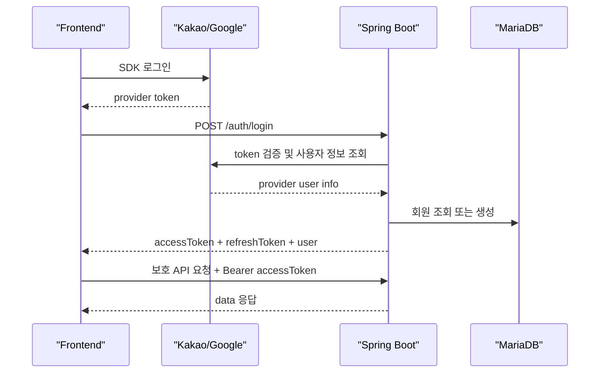

# GenMark AI 백엔드-프론트엔드 연동 명세서

> 문서 버전: `0.1.0-implemented`
>
> 기준일: `2026-08-06`
>
> 기준: 현재 작업 트리의 Spring Boot 백엔드 소스

이 문서는 현재 백엔드 코드에 실제로 구현된 API와 프론트엔드에서 사용해야 하는 필드명, 토큰 규칙, 환경변수를 정리한 문서입니다.

## 0. 먼저 확인할 사항

현재 백엔드 소스에 실제로 구현된 REST API는 인증 API 4개입니다.

| Method | Path | 인증 | 상태 |
|---|---|---:|---|
| `POST` | `/api/v1/auth/login` | 불필요 | 구현됨 |
| `POST` | `/api/v1/auth/refresh` | 불필요 | 구현됨 |
| `POST` | `/api/v1/auth/logout` | 불필요 | 구현됨 |
| `GET` | `/api/v1/me` | 필요 | 구현됨 |

기존 `frontend/docs/API_SPEC.md`에는 프로젝트, 로고 생성, 상표 분석 API도 정의되어 있지만, 현재 백엔드 소스에는 해당 컨트롤러가 없습니다. 따라서 아래 문서는 **현재 구현된 인증 API의 실제 계약**을 기준으로 합니다.

## 1. 실행 환경과 환경변수

### 1.1 기본 주소

로컬에서 백엔드를 직접 실행하면 다음 주소를 사용합니다.

```text
Backend:  http://localhost:8080
API:      http://localhost:8080/api/v1
```

프론트엔드 `.env`에는 다음처럼 설정합니다.

```env
VITE_API_BASE_URL=http://localhost:8080/api/v1
```

### 1.2 프론트엔드 환경변수

| 변수명 | 필수 여부 | 용도 |
|---|---:|---|
| `VITE_API_BASE_URL` | 권장 | 백엔드 API 기본 주소. 미설정 시 코드 기본값은 `http://localhost:8080/api/v1` |
| `VITE_KAKAO_JS_KEY` | 카카오 로그인 시 필수 | 카카오 JavaScript SDK 초기화 키 |
| `VITE_GOOGLE_CLIENT_ID` | 구글 로그인 시 필수 | Google Identity Services 클라이언트 ID |

예시:

```env
VITE_API_BASE_URL=http://localhost:8080/api/v1
VITE_KAKAO_JS_KEY=카카오_JavaScript_키
VITE_GOOGLE_CLIENT_ID=구글_클라이언트_ID
```

### 1.3 백엔드 환경변수

백엔드 루트 `.env` 또는 Docker Compose 환경에 설정합니다.

| 변수명 | 기본값/예시 | 용도 |
|---|---|---|
| `SPRING_PROFILES_ACTIVE` | `local` | Spring 프로필 |
| `JWT_SECRET` | 로컬 기본값 존재 | GenMark AI access token 서명 키. 운영에서는 반드시 교체 |
| `JWT_ACCESS_TOKEN_EXPIRATION_SECONDS` | `3600` | access token 유효기간(초) |
| `JWT_REFRESH_TOKEN_EXPIRATION_DAYS` | `14` | refresh token 유효기간(일) |
| `GOOGLE_CLIENT_ID` | 빈 값 허용 | 백엔드에서 Google ID token의 `aud` 검증 시 사용 |
| `KAKAO_REST_API_KEY` | 빈 값 허용 | 현재 설정 프로퍼티에는 연결되어 있으나 현재 카카오 검증 코드에서는 직접 사용하지 않음 |
| `AUTH_FAKE_PROVIDER_ENABLED` | 로컬 `true`, 운영 `false` 권장 | 실제 OAuth 키 없이 로컬 로그인 흐름 테스트 |

주의:

- `KAKAO_REST_API_KEY`는 프론트엔드에 전달하지 않습니다.
- 현재 카카오 검증은 프론트에서 받은 카카오 access token을 백엔드가 `Authorization: Bearer`로 카카오 사용자 정보 API에 전달하는 방식입니다.
- `KAKAO_REST_API_KEY`를 사용하는 authorization-code/token 교환 방식은 현재 백엔드에 구현되어 있지 않습니다.
- `.env` 파일은 Git에 커밋하지 않습니다.

## 2. 공통 응답 형식

### 2.1 성공 응답

인증 API의 `200` 응답은 항상 실제 데이터를 `data` 안에 담습니다.

```json
{
  "data": {},
  "meta": {
    "requestId": "req_a1b2c3d4e5f60708",
    "timestamp": "2026-08-06T12:00:00Z"
  }
}
```

프론트엔드는 응답 전체가 아니라 `response.data`를 사용해야 합니다.

### 2.2 오류 응답

```json
{
  "error": {
    "code": "VALIDATION_ERROR",
    "message": "요청값을 확인해주세요.",
    "details": [
      {
        "field": "provider",
        "reason": "provider는 필수입니다."
      }
    ],
    "requestId": "req_a1b2c3d4e5f60708"
  }
}
```

`details`는 검증 오류가 아니면 보통 빈 배열입니다. 장애 문의나 로그 추적이 필요하면 `requestId`를 함께 기록합니다.

### 2.3 공통 요청 규칙

```http
Content-Type: application/json
```

보호된 API에는 다음 헤더를 추가합니다.

```http
Authorization: Bearer {accessToken}
```

## 3. 인증 흐름



### 토큰 종류

| 토큰 | 발급 주체 | 프론트엔드 사용처 | 백엔드 처리 |
|---|---|---|---|
| provider token | 카카오 또는 구글 | 로그인 직후 `/auth/login`에 한 번 전달 | 외부 provider API로 검증 |
| access token | GenMark AI 백엔드 | 보호 API의 `Authorization` 헤더 | JWT 서명 및 만료 검증 |
| refresh token | GenMark AI 백엔드 | access token 재발급 요청 | 원문이 아닌 SHA-256 해시로 저장, 사용 시 rotate |

### 프론트엔드 토큰 처리 규칙

1. `/auth/login` 성공 시 `accessToken`, `refreshToken`을 모두 저장합니다.
2. 보호 API에 `Authorization: Bearer {accessToken}`을 붙입니다.
3. `401`과 `TOKEN_EXPIRED`를 받으면 `/auth/refresh`를 호출합니다.
4. refresh 성공 시 **새 access token과 새 refresh token을 모두 교체**합니다.
5. refresh도 실패하면 두 토큰을 삭제하고 로그인 화면으로 이동합니다.
6. 로그아웃 시 `/auth/logout` 호출 여부와 관계없이 프론트의 토큰을 삭제합니다.

현재 프론트 코드가 사용하는 localStorage 키는 다음과 같습니다.

```text
genmark.refresh-token
```

## 4. 인증 API 상세

### 4.1 로그인

```http
POST /api/v1/auth/login
```

인증 헤더 없이 호출합니다.

#### Request body

```json
{
  "provider": "kakao",
  "idToken": "provider-token",
  "redirectUri": "http://localhost:5173"
}
```

| 필드 | 타입 | 필수 | 허용값/설명 |
|---|---|---:|---|
| `provider` | `string` | O | `kakao`, `google`, `fake` |
| `idToken` | `string` | O | provider별 로그인 토큰. 카카오의 경우 실제로는 access token |
| `redirectUri` | `string` | X | 현재 백엔드에서는 받기만 하고 사용하지 않음 |

빈 문자열 또는 공백만 있는 필수값은 `422 VALIDATION_ERROR`가 됩니다.

#### provider별 `idToken` 의미

| provider | 전달해야 하는 값 | 백엔드 검증 방식 |
|---|---|---|
| `kakao` | `Kakao.Auth.login()` 성공 콜백의 `authObj.access_token` | `https://kapi.kakao.com/v2/user/me`에 Bearer token으로 전달 |
| `google` | Google Identity Services가 반환한 ID token JWT(`credential`) | `https://oauth2.googleapis.com/tokeninfo?id_token=...` 호출 |
| `fake` | 비어 있지 않은 임의의 문자열 | 로컬 테스트용 사용자 식별자로 사용 |

중요: Google access token은 현재 백엔드의 Google 검증기에서 기대하는 ID token이 아니므로 사용할 수 없습니다. 프론트에서 `google.accounts.oauth2.initTokenClient()`가 반환한 access token을 보내면 검증에 실패합니다. Google 로그인은 `frontend/src/lib/googleAuth.ts`의 `getGoogleIdToken()`처럼 ID token을 받아 보내거나, 백엔드 검증 방식을 access token용으로 변경해야 합니다.

#### Response `200`

```json
{
  "data": {
    "accessToken": "eyJhbGciOiJIUzI1NiJ9...",
    "refreshToken": "rt_xxxxxxxxxxxxxxxxx",
    "expiresIn": 3600,
    "user": {
      "id": "1",
      "email": "user@example.com",
      "name": "홍길동",
      "provider": "kakao",
      "isFirstLogin": true
    },
    "resumeProjectId": null
  },
  "meta": {
    "requestId": "req_a1b2c3d4e5f60708",
    "timestamp": "2026-08-06T12:00:00Z"
  }
}
```

#### Response data

| 필드 | 타입 | 설명 |
|---|---|---|
| `accessToken` | `string` | GenMark AI JWT access token |
| `refreshToken` | `string` | GenMark AI opaque refresh token |
| `expiresIn` | `number` | access token 유효기간(초) |
| `user.id` | `string` | GenMark AI DB 회원 ID. provider의 회원 ID가 아님 |
| `user.email` | `string` | provider에서 받은 이메일. 없거나 중복이면 합성 이메일로 저장 |
| `user.name` | `string` | provider에서 받은 이름/닉네임 |
| `user.provider` | `string` | `kakao`, `google`, `fake` |
| `user.isFirstLogin` | `boolean` | `(provider, providerId)` 기준 최초 회원 생성 여부 |
| `resumeProjectId` | `string \| null` | 현재 프로젝트 도메인이 없어 항상 `null` |

이메일 동의를 거부했거나 이미 다른 회원이 같은 이메일을 사용 중이면 백엔드는 다음 규칙의 합성 이메일을 사용합니다.

```text
{provider}+{providerId}@oauth.genmark.local
```

### 4.2 Access token 재발급

```http
POST /api/v1/auth/refresh
```

인증 헤더는 필요하지 않습니다.

#### Request body

```json
{
  "refreshToken": "rt_xxxxxxxxxxxxxxxxx"
}
```

#### Response `200`

```json
{
  "data": {
    "accessToken": "eyJhbGciOiJIUzI1NiJ9...",
    "refreshToken": "rt_newxxxxxxxxxxxxxxx",
    "expiresIn": 3600
  },
  "meta": {
    "requestId": "req_a1b2c3d4e5f60708",
    "timestamp": "2026-08-06T12:00:00Z"
  }
}
```

refresh token은 rotate됩니다. 기존 refresh token을 계속 사용하지 말고 응답으로 받은 새 값을 저장합니다.

### 4.3 로그아웃

```http
POST /api/v1/auth/logout
```

인증 헤더는 필요하지 않습니다. Request body는 `/auth/refresh`와 같습니다.

```json
{
  "refreshToken": "rt_xxxxxxxxxxxxxxxxx"
}
```

#### Response `204`

응답 본문이 없습니다. 프론트엔드는 `response.json()`을 호출하지 말고, 성공 여부를 확인한 뒤 localStorage와 메모리의 토큰을 삭제합니다.

### 4.4 현재 사용자 조회

```http
GET /api/v1/me
Authorization: Bearer {accessToken}
```

#### Response `200`

```json
{
  "data": {
    "user": {
      "id": "1",
      "email": "user@example.com",
      "name": "홍길동",
      "provider": "kakao",
      "isFirstLogin": false
    },
    "resumeProjectId": null
  },
  "meta": {
    "requestId": "req_a1b2c3d4e5f60708",
    "timestamp": "2026-08-06T12:00:00Z"
  }
}
```

주의:

- `/me`는 로그인 시점의 `isFirstLogin`을 복원하지 않고 항상 `false`를 반환합니다.
- 현재 프로젝트 테이블과 진행상태 연동이 없어 `resumeProjectId`는 항상 `null`입니다.

## 5. 프론트엔드 TypeScript 타입

```ts
export type AuthProvider = 'kakao' | 'google' | 'fake'

export interface UserSummary {
  id: string
  email: string
  name: string
  provider: AuthProvider
  isFirstLogin: boolean
}

export interface LoginRequest {
  provider: AuthProvider
  idToken: string
  redirectUri?: string
}

export interface LoginResult {
  accessToken: string
  refreshToken: string
  expiresIn: number
  user: UserSummary
  resumeProjectId: string | null
}

export interface RefreshResult {
  accessToken: string
  refreshToken: string
  expiresIn: number
}

export interface MeResult {
  user: UserSummary
  resumeProjectId: string | null
}

export interface ApiMeta {
  requestId: string
  timestamp: string
}

export interface ApiSuccess<T> {
  data: T
  meta: ApiMeta
}

export interface ApiErrorDetail {
  field: string
  reason: string
}

export interface ApiErrorBody {
  code: string
  message: string
  details: ApiErrorDetail[]
  requestId: string
}

export interface ApiErrorResponse {
  error: ApiErrorBody
}
```

## 6. 오류 코드와 프론트 처리

| HTTP | `error.code` | 의미 | 프론트 처리 |
|---:|---|---|---|
| `400` | `PROVIDER_NOT_SUPPORTED` | 지원하지 않는 provider 또는 비활성화된 `fake` | 로그인 provider 설정 확인 |
| `401` | `AUTH_REQUIRED` | access token이 없거나 잘못됨 | 로그인 화면 또는 재로그인 |
| `401` | `TOKEN_EXPIRED` | access token 또는 refresh token 만료 | access token이면 refresh 시도, refresh도 실패하면 재로그인 |
| `401` | `OAUTH_VERIFICATION_FAILED` | 카카오/구글 provider token 검증 실패 | provider token 종류와 SDK 설정 확인 |
| `422` | `VALIDATION_ERROR` | 필수 body 필드 누락/공백 | `details`의 `field`와 `reason` 표시 |
| `403` | `AUTH_REQUIRED` | 접근 권한 부족 | 권한 없음 안내 |
| `500` | `INTERNAL_ERROR` | 서버 내부 오류 | 일반 오류 안내 및 `requestId` 기록 |

`/auth/login`에 빈 body를 보낸 경우 예시는 다음과 같습니다.

```json
{
  "error": {
    "code": "VALIDATION_ERROR",
    "message": "요청값을 확인해주세요.",
    "details": [
      {
        "field": "provider",
        "reason": "provider는 필수입니다."
      },
      {
        "field": "idToken",
        "reason": "idToken은 필수입니다."
      }
    ],
    "requestId": "req_a1b2c3d4e5f60708"
  }
}
```

## 7. 프론트엔드 호출 예시

### 로그인

```ts
const response = await fetch(`${import.meta.env.VITE_API_BASE_URL}/auth/login`, {
  method: 'POST',
  headers: { 'Content-Type': 'application/json' },
  body: JSON.stringify({
    provider: 'kakao',
    idToken: kakaoAccessToken,
    redirectUri: window.location.origin,
  }),
})

const body: ApiSuccess<LoginResult> = await response.json()
const session = body.data
```

### 인증 API 호출

```ts
const response = await fetch(`${import.meta.env.VITE_API_BASE_URL}/me`, {
  headers: {
    Authorization: `Bearer ${accessToken}`,
  },
})

const body: ApiSuccess<MeResult> = await response.json()
const currentUser = body.data.user
```

### 응답 처리 시 주의

```ts
// 올바른 사용
const session = responseBody.data

// 잘못된 사용: responseBody 자체를 LoginResult로 취급하면 안 됨
// const session = responseBody
```

## 8. CORS와 보안 설정

현재 백엔드가 허용하는 프론트 개발 origin은 다음 두 개입니다.

```text
http://localhost:5173
http://localhost:3000
```

허용 메서드:

```text
GET, POST, PUT, PATCH, DELETE, OPTIONS
```

허용 헤더는 전체(`*`)이며, credentials 허용이 켜져 있습니다. 운영 프론트 도메인을 사용할 때는 `SecurityConfig`에 해당 origin을 추가해야 합니다.

현재 보안 규칙:

| 경로 | 규칙 |
|---|---|
| `/api/v1/auth/**` | 공개 |
| `/api/v1/me` | JWT access token 필요 |
| 그 외 현재 등록된 `/api/**` | 공개 규칙에 포함 |
| `/`, `/member/**` | 서버 렌더링 페이지 및 기존 폼 기능 |

향후 프로젝트 API를 추가할 때는 `/api/**` 공개 규칙보다 먼저 인증 규칙을 명시해야 합니다. 그렇지 않으면 새 `/api/v1/projects/**`가 의도와 달리 공개될 수 있습니다.

## 9. 현재 프론트엔드에서 확인해야 할 연동 이슈

1. **Google 토큰 타입 불일치**
   - 백엔드 `GoogleOAuthVerifier`는 Google ID token JWT를 기대합니다.
   - 현재 `frontend/src/auth.ts`의 `getGoogleToken()`은 `initTokenClient()`로 access token을 받아 보내는 흐름입니다.
   - 현재 백엔드 계약을 유지하려면 `frontend/src/lib/googleAuth.ts`의 `getGoogleIdToken()`을 사용해야 합니다.

2. **카카오 REST 키의 역할**
   - 프론트에는 `VITE_KAKAO_JS_KEY`를 사용합니다.
   - 카카오 로그인 결과인 access token을 `/auth/login`의 `idToken` 필드에 전달합니다.
   - REST API 키를 프론트에 노출하지 않습니다.

3. **기존 프로젝트 API 명세와 실제 구현 차이**
   - 현재 소스에는 `/projects`, `/logo-generations`, `/trademark-analyses`, `/logo-edits` 등의 컨트롤러가 없습니다.
   - 해당 화면을 프론트에서 구현하더라도 현재 백엔드에는 호출할 API가 없으므로 백엔드 API 구현 후 이 문서를 갱신해야 합니다.

4. **`redirectUri`**
   - 로그인 요청 DTO에는 `redirectUri`가 있지만 현재 `AuthController`와 `AuthService`에서는 사용하지 않습니다.
   - 프론트에서 보내도 되지만 현재 동작에는 영향을 주지 않습니다.

## 10. 서버 렌더링 레거시 경로

아래 경로는 React 프론트용 JSON API가 아니라 기존 Thymeleaf/form 기능입니다.

| Method | Path | 응답/요청 |
|---|---|---|
| `GET` | `/` | HTML 홈 화면 |
| `GET` | `/member/login` | HTML 로그인 화면 |
| `GET` | `/member/join` | HTML 회원가입 화면 |
| `POST` | `/member/join` | form parameter `email`, `password`, `name`; 완료 후 `/member/login`으로 redirect |

React 프론트에서는 위 경로 대신 `/api/v1/auth/**` 인증 API를 사용합니다.

## 11. 백엔드 기준 파일

- `backend/src/main/java/com/genmark/ai/web/controller/AuthController.java`
- `backend/src/main/java/com/genmark/ai/web/dto/auth/`
- `backend/src/main/java/com/genmark/ai/service/AuthService.java`
- `backend/src/main/java/com/genmark/ai/oauth/KakaoOAuthVerifier.java`
- `backend/src/main/java/com/genmark/ai/oauth/GoogleOAuthVerifier.java`
- `backend/src/main/java/com/genmark/ai/config/SecurityConfig.java`
- `backend/src/main/java/com/genmark/ai/security/JwtAuthenticationFilter.java`
- `backend/src/main/java/com/genmark/ai/web/exception/`
- `backend/src/main/resources/application.properties`

이 문서와 실제 코드가 달라지면 프론트 연동 전에 이 문서를 먼저 갱신합니다.
