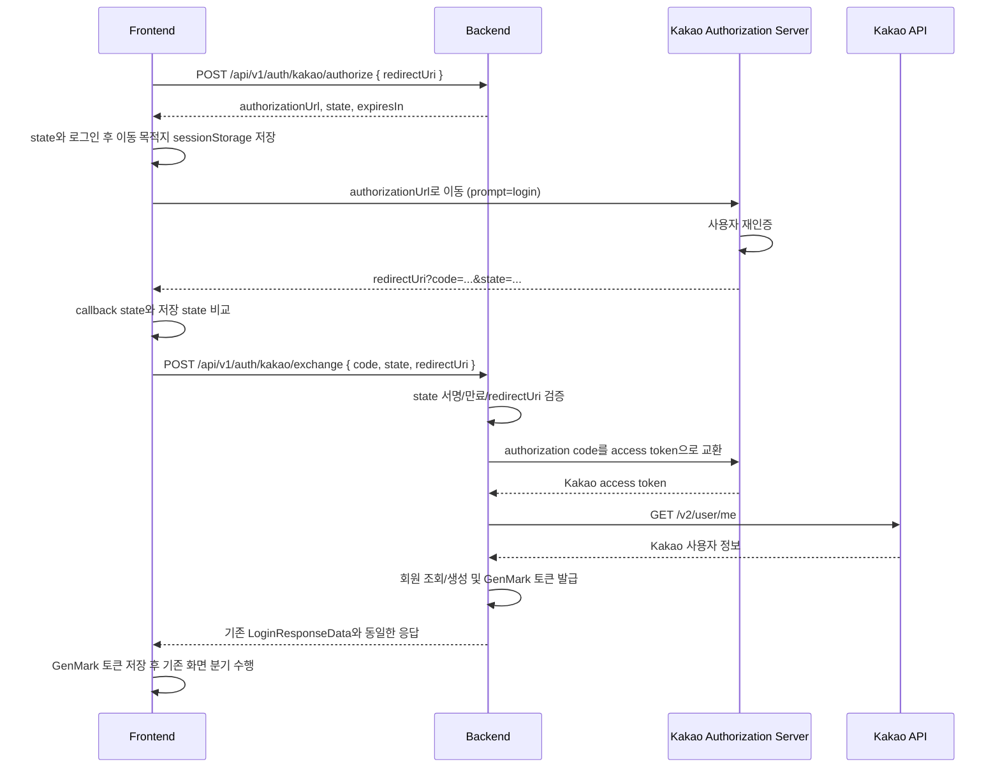

# Kakao 재인증 로그인 전환 가이드

## 1. 문서 목적

이 문서는 GenMark에서 로그아웃한 사용자가 다시 **카카오로 계속하기**를 눌렀을 때, 기존 카카오 계정 세션으로 자동 로그인되지 않고 카카오가 사용자를 다시 인증하도록 만드는 구현 계약을 정의한다.

프론트엔드와 백엔드가 서로 다른 시점에 배포되어도 기존 Google 로그인이 깨지지 않도록 다음 원칙을 사용한다.

- 기존 `POST /api/v1/auth/login`은 Google 로그인용으로 유지한다.
- Kakao Authorization Code 흐름은 별도 API로 추가한다.
- 백엔드를 먼저 배포하고 프론트엔드를 나중에 전환할 수 있게 한다.
- 프론트엔드는 Kakao REST API 키를 환경변수로 직접 관리하지 않고, Client Secret은 절대 보유하지 않는다.
- Kakao access token, GenMark access token, refresh token을 URL에 넣지 않는다.
- GenMark 로그아웃과 Kakao 계정 전체 로그아웃을 혼동하지 않는다.

관련 공식 문서:

- Kakao Login REST API: <https://developers.kakao.com/docs/en/kakaologin/rest-api>
- Kakao Login JavaScript SDK: <https://developers.kakao.com/docs/en/kakaologin/js>

---

## 2. 요구사항

### 2.1 사용자 요구사항

```text
GenMark 로그아웃
→ 카카오 로그인 다시 선택
→ 기존 카카오 세션이 있어도 카카오 로그인 화면 표시
→ 사용자 재인증
→ 새로운 GenMark 로그인 세션 발급
```

### 2.2 비요구사항

다음 동작은 이 작업의 목표가 아니다.

- 사용자를 브라우저의 카카오 계정 자체에서 완전히 로그아웃시키기
- 다른 카카오 서비스의 로그인 상태까지 종료하기
- Kakao 연결 끊기(Unlink) 수행하기
- Google 로그인 프로토콜 변경하기

카카오 계정 전체 로그아웃 대신, 인증 요청에 항상 `prompt=login`을 포함해 이번 로그인에서 재인증을 요구한다.

---

## 3. 현재 구현과 문제

### 3.1 현재 흐름

```text
Frontend Kakao.Auth.login()
→ Kakao access token을 브라우저에서 직접 수신
→ POST /api/v1/auth/login
   { provider: "kakao", idToken: "Kakao access token" }
→ Backend가 /v2/user/me로 사용자 확인
→ GenMark accessToken/refreshToken 발급
```

현재 관련 파일:

- `frontend/src/lib/kakaoAuth.ts`
- `frontend/src/auth.ts`
- `backend/src/main/java/com/genmark/ai/web/controller/AuthController.java`
- `backend/src/main/java/com/genmark/ai/service/AuthService.java`
- `backend/src/main/java/com/genmark/ai/oauth/KakaoOAuthVerifier.java`

### 3.2 현재 문제

1. `Kakao.Auth.login()`은 브라우저에 남아 있는 카카오 계정 세션을 사용할 수 있다.
2. GenMark 로그아웃은 GenMark refresh token만 무효화하며, 카카오 계정 세션은 종료하지 않는다.
3. 따라서 GenMark 로그아웃은 성공했어도 다음 Kakao 로그인에서 재인증 화면이 생략될 수 있다.
4. 현재 `LoginRequest.idToken`은 Kakao에서는 실제로 access token을 담고 있어 이름과 값의 의미가 일치하지 않는다.
5. 현재 `AuthService`는 Kakao 로그인을 항상 첫 로그인으로 처리하는 코드가 있어 재로그인 시 온보딩이 다시 표시될 수 있다.

현재 잘못된 판정:

```java
boolean isFirstLogin = member == null || "kakao".equals(provider);
```

반드시 다음 의미로 수정해야 한다.

```java
boolean isFirstLogin = member == null;
```

---

## 4. 합의된 목표 구조

Kakao 로그인만 Authorization Code 흐름으로 전환한다.



핵심은 `prompt=login`이 프론트 화면 연출이 아니라 Kakao가 실제 재인증을 수행하도록 요청하는 값이라는 점이다.

---

## 5. API 계약

기존 성공 응답 봉투는 그대로 유지한다.

```json
{
  "data": {},
  "meta": {
    "requestId": "req_...",
    "timestamp": "2026-08-07T00:00:00Z"
  }
}
```

### 5.1 Kakao 인증 시작 정보 발급

`POST /api/v1/auth/kakao/authorize`

인증이 필요 없는 공개 API지만 rate limit 대상이어야 한다.

#### 요청

```json
{
  "redirectUri": "http://localhost/auth/kakao/callback"
}
```

#### 성공 응답: `200 OK`

```json
{
  "data": {
    "authorizationUrl": "https://kauth.kakao.com/oauth/authorize?...",
    "state": "signed-short-lived-state",
    "expiresIn": 300
  },
  "meta": {
    "requestId": "req_...",
    "timestamp": "2026-08-07T00:00:00Z"
  }
}
```

백엔드가 생성하는 `authorizationUrl`에는 반드시 다음 값이 있어야 한다.

| 파라미터 | 값 |
|---|---|
| `client_id` | `KAKAO_REST_API_KEY` |
| `redirect_uri` | 검증된 요청의 `redirectUri` |
| `response_type` | `code` |
| `prompt` | `login` |
| `state` | 백엔드가 발급한 서명된 state |

프론트에서 URL 문자열을 직접 조립하지 않는다. URL 인코딩 실수, 환경별 키 불일치, `prompt=login` 누락을 막기 위해 백엔드가 완성된 URL을 반환한다.

### 5.2 Kakao code 교환 및 GenMark 로그인

`POST /api/v1/auth/kakao/exchange`

#### 요청

```json
{
  "code": "authorization-code-from-kakao",
  "state": "signed-short-lived-state",
  "redirectUri": "http://localhost/auth/kakao/callback"
}
```

#### 성공 응답: `200 OK`

기존 `POST /api/v1/auth/login`의 `LoginResponseData`와 완전히 같은 구조를 사용한다.

```json
{
  "data": {
    "accessToken": "eyJ...",
    "refreshToken": "rt_...",
    "expiresIn": 3600,
    "user": {
      "id": "8",
      "email": "kakao+1234@oauth.genmark.local",
      "name": "사용자",
      "provider": "kakao",
      "isFirstLogin": false
    },
    "resumeProjectId": null
  },
  "meta": {
    "requestId": "req_...",
    "timestamp": "2026-08-07T00:00:00Z"
  }
}
```

`isFirstLogin`은 같은 `provider + providerId` 회원이 이미 있으면 반드시 `false`여야 한다.

### 5.3 기존 API 호환성

`POST /api/v1/auth/login`은 다음과 같이 유지한다.

| provider | 마이그레이션 중 | 마이그레이션 완료 후 |
|---|---|---|
| `google` | 기존 ID token 로그인 유지 | 유지 |
| `fake` | 로컬에서만 기존 방식 유지 | 유지 |
| `kakao` | 짧은 전환 기간 동안만 기존 access token 허용 가능 | 사용 중단 또는 명시적 거절 |

프론트 전환이 확인되기 전에 기존 Kakao 경로를 먼저 제거하면 로그인 장애가 발생한다. 반드시 백엔드 신규 API 배포 후 프론트 전환 순서를 지킨다.

---

## 6. 백엔드 구현 상세

### 6.1 환경변수

다음 값을 백엔드에 추가한다.

| 환경변수 | 용도 | 노출 정책 |
|---|---|---|
| `KAKAO_REST_API_KEY` | authorize/token 요청의 client ID | 백엔드 설정값. authorize URL에서는 공개됨 |
| `KAKAO_CLIENT_SECRET` | authorization code를 token으로 교환 | 절대 프론트 노출 금지 |
| `KAKAO_ALLOWED_REDIRECT_URIS` | 허용 callback URI 목록 | 백엔드 전용 |
| `OAUTH_STATE_SECRET` | state 서명/검증 | 최소 32바이트, 백엔드 전용 |

로컬 예시:

```dotenv
KAKAO_REST_API_KEY=발급받은_REST_API_KEY
KAKAO_CLIENT_SECRET=발급받은_CLIENT_SECRET
KAKAO_ALLOWED_REDIRECT_URIS=http://localhost/auth/kakao/callback,http://localhost:5173/auth/kakao/callback
OAUTH_STATE_SECRET=충분히_긴_랜덤_문자열
```

다음 파일에도 설정 전달을 추가해야 한다.

- `backend/src/main/resources/application-local.properties`
- `backend/src/main/resources/application-prod.properties`
- `docker-compose.local.yml`
- 운영 배포 환경의 secret 설정

운영 환경에서 `KAKAO_CLIENT_SECRET`, `OAUTH_STATE_SECRET`에 기본값을 두지 않는다.

### 6.2 권장 클래스 분리

기존 역할을 섞지 않도록 다음처럼 분리한다.

```text
web/dto/auth/
  KakaoAuthorizeRequest.java
  KakaoAuthorizeResponseData.java
  KakaoCodeExchangeRequest.java

oauth/
  KakaoAuthorizationClient.java   # authorize URL 생성, code → token 교환
  KakaoOAuthVerifier.java         # access token으로 /v2/user/me 조회
  OAuthStateService.java          # state 발급/검증

service/
  AuthService.java                # 공통 회원 조회/생성, GenMark 토큰 발급

web/controller/
  AuthController.java             # 신규 두 API 노출
```

`KakaoOAuthVerifier.verify(accessToken)`의 사용자 조회 기능은 재사용할 수 있다. 다만 code 교환 책임을 `KakaoOAuthVerifier`에 함께 넣지 말고 `KakaoAuthorizationClient`로 분리한다.

### 6.3 state 정책

`state`는 로그인 CSRF를 막기 위한 값이다.

필수 조건:

- 매 로그인 시도마다 다른 랜덤 nonce 포함
- 발급 시각과 만료 시각 포함
- 요청 `redirectUri`와 결합
- 서버에서 위변조 검증 가능하도록 서명
- 유효시간 5분 권장
- 검증 실패 시 Kakao token API를 호출하지 않음

프론트도 반환받은 state를 `sessionStorage`에 저장하고 callback의 state와 먼저 비교한다. 백엔드는 프론트 검증만 믿지 않고 서명, 만료, redirect URI를 다시 검증한다.

추가 replay 방지가 필요하면 이미 사용된 state nonce를 5분 동안 저장하고 두 번째 사용을 거절한다. 단일 서버 로컬 환경에서는 메모리 저장소를 사용할 수 있지만, 다중 인스턴스 운영에서는 Redis 같은 공유 저장소가 필요하다.

### 6.4 redirect URI 검증

요청으로 받은 임의의 URI를 그대로 사용하면 안 된다.

- `KAKAO_ALLOWED_REDIRECT_URIS`와 완전 일치하는 값만 허용한다.
- scheme, host, port, path를 모두 비교한다.
- 운영 환경은 HTTPS만 허용한다.
- 검증된 redirect URI와 token 교환 요청의 redirect URI는 완전히 같아야 한다.
- 허용되지 않은 URI는 Kakao API를 호출하기 전에 거절한다.

로컬 Nginx는 `try_files $uri $uri/ /index.html`을 사용하므로 `/auth/kakao/callback` 경로에서도 SPA가 로드된다.

### 6.5 Kakao token 교환

백엔드에서 다음 요청을 수행한다.

```http
POST https://kauth.kakao.com/oauth/token
Content-Type: application/x-www-form-urlencoded;charset=utf-8

grant_type=authorization_code
client_id={KAKAO_REST_API_KEY}
redirect_uri={검증된 redirectUri}
code={authorizationCode}
client_secret={KAKAO_CLIENT_SECRET}
```

응답의 `access_token`만 `KakaoOAuthVerifier.verify(accessToken)`에 전달한다.

보안 규칙:

- authorization code를 로그에 출력하지 않는다.
- Kakao access token을 로그나 DB에 저장하지 않는다.
- Client Secret을 요청/응답/로그에 포함하지 않는다.
- token 교환 후 사용자 조회에 필요한 동안만 access token을 메모리에서 사용한다.
- Kakao access token을 프론트에 반환하지 않는다.

### 6.6 회원 조회와 첫 로그인 판정

Kakao 사용자 정보를 받은 뒤 기존 회원 조회 키를 그대로 사용한다.

```text
provider = "kakao"
providerId = Kakao user id
```

반드시 회원 생성 전 상태로 첫 로그인을 판단한다.

```java
Member member = memberRepository
        .findByProviderAndProviderId("kakao", info.providerId())
        .orElse(null);

boolean isFirstLogin = member == null;

if (member == null) {
    member = createMember("kakao", info);
}
```

기존 `login(provider, token)`과 신규 `loginWithKakaoCode(...)`가 회원 생성 코드를 각각 복사하지 않도록 공통 private 메서드로 추출한다.

예시 역할:

```java
private LoginResult completeOAuthLogin(String provider, OAuthUserInfo info)
```

이렇게 해야 Google/Kakao의 `isFirstLogin`, refresh token 발급, 응답 형식이 서로 달라지는 문제를 막을 수 있다.

### 6.7 오류 코드

다음 오류를 명시적으로 구분하는 것을 권장한다.

| 오류 코드 | HTTP | 상황 |
|---|---:|---|
| `OAUTH_REDIRECT_URI_INVALID` | 400 | 허용되지 않은 callback URI |
| `OAUTH_STATE_INVALID` | 400 | state 누락, 위변조, 만료, URI 불일치 |
| `OAUTH_CODE_EXCHANGE_FAILED` | 401 | code 만료, 재사용, 잘못된 code |
| `OAUTH_PROVIDER_UNAVAILABLE` | 502 | Kakao token/user API 장애 또는 타임아웃 |
| `OAUTH_VERIFICATION_FAILED` | 401 | Kakao 사용자 정보 검증 실패 |

프론트는 오류 문자열을 파싱하지 않고 `error.code`로 분기한다.

### 6.8 Spring Security와 CORS

- `/api/v1/auth/kakao/authorize`와 `/api/v1/auth/kakao/exchange`는 로그인 전 호출되므로 `permitAll`이어야 한다.
- 현재 `/api/v1/auth/**`가 이미 `permitAll`이라 별도 규칙이 필요 없는지 확인한다.
- 허용 프론트 origin에 실제 로컬 Nginx 주소 `http://localhost`와 Vite 주소를 반영한다.
- 운영 환경에서는 정확한 HTTPS origin만 허용한다.
- `*` origin과 credential 허용을 함께 사용하지 않는다.

---

## 7. 프론트엔드 구현 계약

백엔드 담당자도 아래 프론트 흐름을 기준으로 API를 구현해야 한다.

### 7.1 Kakao 로그인 시작

기존 흐름:

```ts
Kakao.Auth.login(...)
```

신규 흐름:

```text
POST /api/v1/auth/kakao/authorize
→ state와 로그인 후 목적지 저장
→ window.location.assign(authorizationUrl)
```

권장 sessionStorage 키:

```text
genmark.kakao.oauth.state
genmark.kakao.oauth.return-mode
genmark.kakao.oauth.login-destination
```

페이지 전체 redirect 후에도 다음 값을 복원해야 한다.

- Hero 로그인에서 시작했는지
- Home의 로고 생성 시작에서 로그인했는지
- 로그인 성공 후 `home` 또는 `choice` 중 어디로 갈지

### 7.2 callback 처리

callback 경로 예시:

```text
http://localhost/auth/kakao/callback
```

프론트 처리 순서:

1. URL에서 `code`, `state`, `error`, `error_description`을 읽는다.
2. `error`가 있으면 로그인 화면으로 돌아가 사용자에게 취소/실패 메시지를 보여준다.
3. callback state와 sessionStorage state를 비교한다.
4. 일치하지 않으면 백엔드 exchange를 호출하지 않는다.
5. 일치하면 `POST /api/v1/auth/kakao/exchange`를 한 번만 호출한다.
6. 성공하면 기존 `saveTokens(session)` 로직을 그대로 사용한다.
7. state와 callback 쿼리 파라미터를 제거한다.
8. `session.user.isFirstLogin`과 저장된 로그인 목적지로 기존 화면 분기를 수행한다.

React 개발 모드의 Strict Mode 또는 새로고침으로 exchange가 두 번 호출되지 않도록 요청 중 상태 또는 sessionStorage 처리 완료 플래그를 사용한다. Kakao authorization code는 한 번만 사용할 수 있다.

### 7.3 프론트 환경변수

백엔드가 완성된 `authorizationUrl`을 반환하므로 프론트는 Kakao 설정값으로 URL을 직접 만들지 않는다.

- `KAKAO_CLIENT_SECRET` 금지
- `OAUTH_STATE_SECRET` 금지

`KAKAO_REST_API_KEY`는 OAuth의 `client_id`이므로 백엔드가 반환한 authorize URL 안에서는 브라우저에 보인다. 이것은 정상이다. 다만 프론트 `.env`에 별도로 복사하거나 token API 호출에 사용하지 않는다. 비밀로 보호해야 하는 값은 `KAKAO_CLIENT_SECRET`과 `OAUTH_STATE_SECRET`이다.

`VITE_KAKAO_JS_KEY`는 다른 Kakao SDK 기능을 사용하지 않는다면 로그인 전환 완료 후 제거할 수 있다. 전환 기간에는 기존 코드를 위해 남겨도 된다.

### 7.4 Google 로그인과의 분리

- Google은 현재 `getGoogleIdToken()`과 `POST /api/v1/auth/login`을 계속 사용한다.
- Kakao callback 로직을 공통 `loginWithProvider()` 안에 억지로 넣지 않는다.
- 공통화는 최종 `AuthSession` 저장과 화면 분기 이후에만 한다.

---

## 8. 로그아웃 계약

GenMark 로그아웃은 현재 계약을 유지한다.

```text
POST /api/v1/auth/logout { refreshToken }
→ 백엔드 DB의 refresh_token_hash, refresh_token_expires_at 제거
→ 프론트 메모리 access token 제거
→ 프론트 localStorage refresh token 제거
```

추가 원칙:

- GenMark 로그아웃 시 사용자를 카카오 계정 전체에서 로그아웃시키지 않는다.
- `Kakao.Auth.logout()`만 호출하는 것으로 재인증 요구사항을 해결했다고 판단하지 않는다.
- 다음 Kakao 로그인 요청에 항상 `prompt=login`을 포함해 재인증을 보장한다.
- 로그아웃 API 실패 시에도 프론트 로컬 토큰은 `finally`에서 제거하되, 서버 실패를 모니터링할 수 있도록 오류 로그를 남긴다.

---

## 9. 배포 순서

호환성을 위해 다음 순서를 반드시 지킨다.

### 1단계: 백엔드 선배포

- 신규 authorize/exchange API 추가
- 신규 환경변수 적용
- `isFirstLogin` 판정 수정
- 기존 `/auth/login`의 Kakao 경로는 임시 유지
- Google 로그인 회귀 테스트

### 2단계: 프론트 배포

- Kakao 로그인 버튼을 신규 authorize 흐름으로 전환
- callback 화면/로직 추가
- 기존 로그인 목적지 복원
- Google 로그인 흐름은 유지

### 3단계: 전환 확인

- 신규 Kakao exchange 호출 비율 확인
- 기존 Kakao access-token 로그인 호출이 없는지 확인
- 오류율과 중복 code 교환 로그 확인

### 4단계: 기존 Kakao 경로 종료

- `POST /api/v1/auth/login`에서 `provider=kakao` 요청 거절
- 프론트의 `Kakao.Auth.login()` 기반 코드 제거
- 더 이상 사용하지 않으면 `VITE_KAKAO_JS_KEY` 제거

---

## 10. 테스트 매트릭스

### 10.1 백엔드 테스트

- [ ] 허용된 redirect URI로 authorize URL 생성
- [ ] authorize URL에 `prompt=login` 포함
- [ ] authorize URL에 `response_type=code` 포함
- [ ] 허용되지 않은 redirect URI 거절
- [ ] 정상 state 검증 성공
- [ ] 변조 state 거절
- [ ] 만료 state 거절
- [ ] state의 redirect URI와 exchange 요청 URI 불일치 거절
- [ ] 정상 code를 Kakao token으로 교환
- [ ] 만료/재사용 code 오류 변환
- [ ] Kakao API 타임아웃을 `OAUTH_PROVIDER_UNAVAILABLE`로 변환
- [ ] 기존 회원 Kakao 재로그인 시 `isFirstLogin=false`
- [ ] 신규 Kakao 회원은 최초 한 번만 `isFirstLogin=true`
- [ ] Google 로그인 기존 테스트 통과
- [ ] logout 후 기존 refresh token 재사용 실패
- [ ] 응답/로그에 Kakao code, access token, Client Secret이 남지 않음

### 10.2 프론트-백엔드 통합 테스트

- [ ] 로그아웃 상태에서 Kakao 로그인 클릭 시 카카오 로그인 화면 표시
- [ ] 카카오 세션이 남아 있어도 로그인 화면 표시
- [ ] 로그인 취소 시 GenMark 로그인 상태가 생성되지 않음
- [ ] 정상 로그인 후 기존 회원은 Home 또는 원래 목적지로 이동
- [ ] 신규 회원만 onboarding/company-details 진행
- [ ] 로그아웃 후 refresh token이 서버와 브라우저에서 무효화됨
- [ ] 같은 callback URL을 새로고침해도 중복 로그인 요청이 발생하지 않음
- [ ] Google 로그인/로그아웃/재로그인에 회귀 없음
- [ ] Hero 로그인과 Home 로고 생성 로그인 목적지가 각각 유지됨

---

## 11. 완료 조건

다음 조건을 모두 만족해야 작업 완료로 본다.

1. GenMark 로그아웃 후 Kakao 로그인 버튼을 누르면 Kakao 재인증 화면이 표시된다.
2. 기존 Kakao 계정 세션이 있어도 자동으로 GenMark 세션이 생성되지 않는다.
3. 사용자 재인증 성공 후에만 새 GenMark access/refresh token이 발급된다.
4. 기존 Kakao 회원의 `isFirstLogin`은 `false`다.
5. 신규 Kakao 회원의 첫 로그인에서만 `isFirstLogin`이 `true`다.
6. Google 로그인 API와 응답 계약은 변경되지 않는다.
7. 프론트 번들, URL, 브라우저 저장소에 Kakao Client Secret이 존재하지 않는다.
8. Kakao code, Kakao access token, GenMark token이 로그나 URL에 노출되지 않는다.
9. 백엔드 선배포와 프론트 후배포 사이에도 기존 로그인이 동작한다.

---

## 12. 역할별 변경 파일 예상 목록

### Backend

- `backend/src/main/java/com/genmark/ai/web/controller/AuthController.java`
- `backend/src/main/java/com/genmark/ai/web/dto/auth/*`
- `backend/src/main/java/com/genmark/ai/service/AuthService.java`
- `backend/src/main/java/com/genmark/ai/oauth/KakaoAuthorizationClient.java` 신규
- `backend/src/main/java/com/genmark/ai/oauth/OAuthStateService.java` 신규
- `backend/src/main/java/com/genmark/ai/oauth/KakaoOAuthVerifier.java`
- `backend/src/main/java/com/genmark/ai/web/exception/ErrorCode.java`
- `backend/src/main/resources/application-local.properties`
- `backend/src/main/resources/application-prod.properties`
- `backend/src/test/**`
- `docker-compose.local.yml`

### Frontend

- `frontend/src/lib/kakaoAuth.ts`
- `frontend/src/auth.ts`
- `frontend/src/App.tsx`
- 필요 시 Kakao callback 전용 모듈 또는 컴포넌트
- `frontend/.env` 및 환경변수 문서 정리

이 문서는 구현 전 프론트엔드와 백엔드가 API 필드명, callback URI, 배포 순서를 확정하기 위한 기준 문서로 사용한다.
