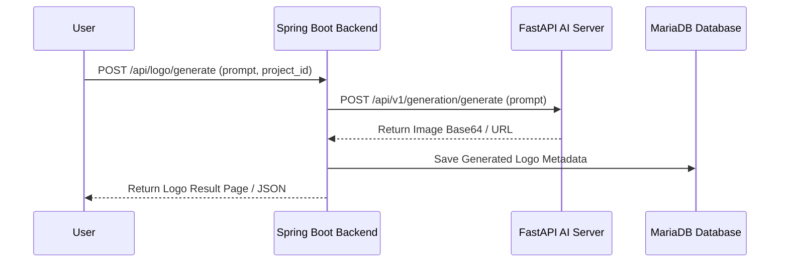
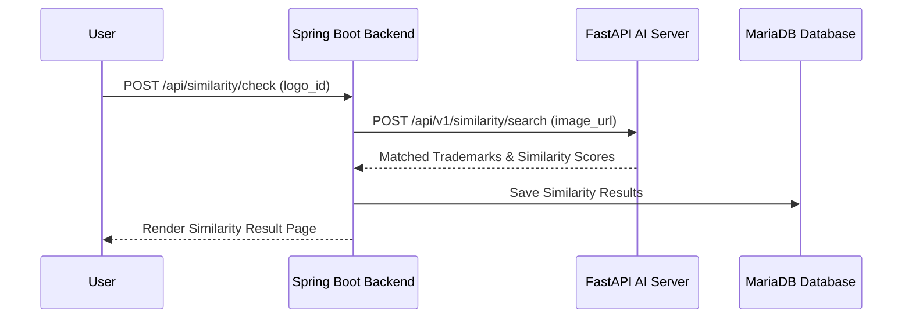

# API Call Flow - GenMark-AI

## 1. Logo Generation Flow

```mermaid
sequenceDiagram
    participant User
    participant SpringBoot as Spring Boot Backend
    participant FastAPI as FastAPI AI Server
    participant MariaDB as MariaDB Database

    User->>SpringBoot: POST /api/logo/generate (prompt, project_id)
    SpringBoot->>FastAPI: POST /api/v1/generation/generate (prompt)
    FastAPI-->>SpringBoot: Return Image Base64 / URL
    SpringBoot->>MariaDB: Save Generated Logo Metadata
    SpringBoot-->>User: Return Logo Result Page / JSON
```

## 2. Similarity Search Flow

```mermaid
sequenceDiagram
    participant User
    participant SpringBoot as Spring Boot Backend
    participant FastAPI as FastAPI AI Server
    participant MariaDB as MariaDB Database

    User->>SpringBoot: POST /api/similarity/check (logo_id)
    SpringBoot->>FastAPI: POST /api/v1/similarity/search (image_url)
    FastAPI-->>SpringBoot: Matched Trademarks & Similarity Scores
    SpringBoot->>MariaDB: Save Similarity Results
    SpringBoot-->>User: Render Similarity Result Page
```
