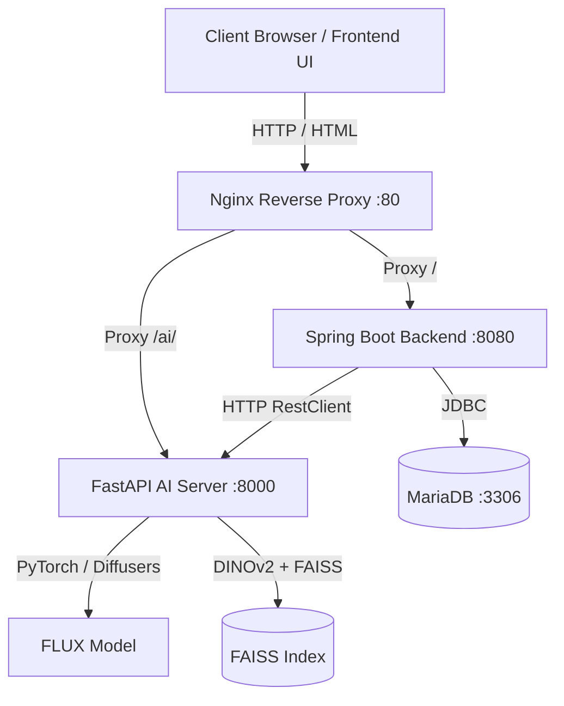

# System Architecture - GenMark-AI

```mermaid
graph TD
    Client[Client Browser / Frontend UI] -->|HTTP / HTML| Nginx[Nginx Reverse Proxy :80]
    Nginx -->|Proxy /| Backend[Spring Boot Backend :8080]
    Nginx -->|Proxy /ai/| AIServer[FastAPI AI Server :8000]
    Backend -->|JDBC| MariaDB[(MariaDB :3306)]
    Backend -->|HTTP RestClient| AIServer
    AIServer -->|PyTorch / Diffusers| FLUX[FLUX Model]
    AIServer -->|DINOv2 + FAISS| VectorDB[(FAISS Index)]
```
