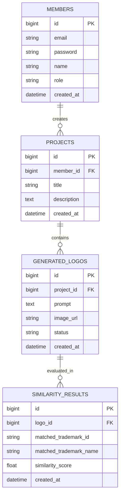

# Entity Relationship Diagram (ERD)

```mermaid
erDiagram
    MEMBERS ||--o{ PROJECTS : creates
    PROJECTS ||--o{ GENERATED_LOGOS : contains
    GENERATED_LOGOS ||--o{ SIMILARITY_RESULTS : evaluated_in

    MEMBERS {
        bigint id PK
        string email
        string password
        string name
        string role
        datetime created_at
    }

    PROJECTS {
        bigint id PK
        bigint member_id FK
        string title
        text description
        datetime created_at
    }

    GENERATED_LOGOS {
        bigint id PK
        bigint project_id FK
        text prompt
        string image_url
        string status
        datetime created_at
    }

    SIMILARITY_RESULTS {
        bigint id PK
        bigint logo_id FK
        string matched_trademark_id
        string matched_trademark_name
        float similarity_score
        datetime created_at
    }
```
