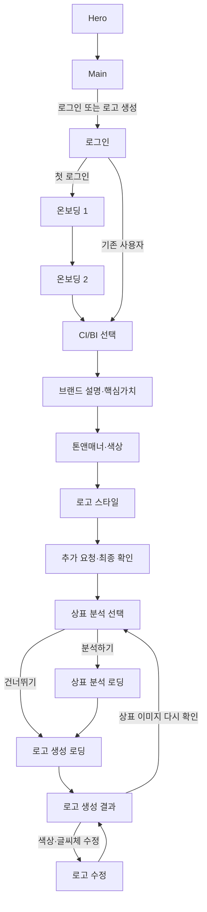

# GenMark AI 백엔드 API 명세서

프론트엔드 화면 흐름과 현재 구현된 입력값을 기준으로 작성한 백엔드 연동 초안입니다.
백엔드는 이 문서를 기준으로 인증, 브랜드 프로젝트 저장, 로고 생성, 상표 이미지 유사도 분석, 로고 수정 기능을 구현합니다.

- 문서 버전: `v1.0.0-draft`
- 작성 기준: GenMark AI Front 현재 화면 흐름
- 기본 형식: JSON (`Content-Type: application/json`)
- 기본 경로: `/api/v1`
- 시간 형식: ISO 8601 UTC (`2026-08-03T09:00:00Z`)

## 1. 서비스 흐름



### 1.1 프로젝트 상태

| 상태 | 설명 | 프론트 화면 |
|---|---|---|
| `DRAFT` | 프로젝트 생성 직후 | CI/BI 선택 전 |
| `ONBOARDING` | 사용 목적과 방문 계기 입력 중 | 온보딩 1·2 |
| `BRAND_TYPE_SELECTED` | CI 또는 BI 선택 완료 | CI/BI 선택 |
| `BRAND_BRIEF_COMPLETED` | 브랜드명·핵심가치 입력 완료 | 브랜드 설명·핵심가치 |
| `TONE_SELECTED` | 톤앤매너와 색상 방식 선택 완료 | 톤앤매너·색상 |
| `STYLE_SELECTED` | 로고 형태 선택 완료 | 로고 스타일 |
| `FINAL_REVIEW` | 추가 요청과 입력 내용 검토 중 | 최종 확인 |
| `TRADEMARK_DECISION` | 상표 이미지 분석 여부 선택 중 | 상표 분석 선택 |
| `GENERATING` | 로고 후보 4개 생성 중 | 로고 생성 로딩 |
| `TRADEMARK_ANALYZING` | 선택 후보의 상표 이미지 유사도 분석 중 | 상표 분석 로딩 |
| `RESULT_READY` | 로고 후보를 확인할 수 있음 | 로고 생성 결과 |
| `EDITING` | 후보의 심볼 또는 텍스트 편집 중 | 로고 수정 |
| `COMPLETED` | 사용자가 최종 후보를 선택함 | 결과 화면 이후 |

상태 변경은 클라이언트가 임의로 직접 지정하지 않고, 각 API의 성공 응답에 포함된 `project.status`를 사용합니다.

## 2. 공통 규칙

### 2.1 인증

로그인 완료 후 발급받은 액세스 토큰을 모든 프로젝트 API에 전달합니다.

```http
Authorization: Bearer {accessToken}
```

인증 없이 접근 가능한 API는 로그인 API와 공개 큐레이션 갤러리 API뿐입니다.

### 2.2 공통 성공 응답

```json
{
  "data": {},
  "meta": {
    "requestId": "req_01J9Z3KQ4V",
    "timestamp": "2026-08-03T09:00:00Z"
  }
}
```

### 2.3 공통 오류 응답

```json
{
  "error": {
    "code": "VALIDATION_ERROR",
    "message": "요청값을 확인해주세요.",
    "details": [
      {
        "field": "brandName",
        "reason": "브랜드명은 1~80자여야 합니다."
      }
    ],
    "requestId": "req_01J9Z3KQ4V"
  }
}
```

### 2.4 HTTP 상태 코드

| 코드 | 사용 기준 |
|---|---|
| `200` | 조회·수정 성공 |
| `201` | 리소스 생성 성공 |
| `202` | 비동기 생성/분석 작업 접수 |
| `204` | 본문 없는 성공 |
| `400` | 잘못된 요청 |
| `401` | 인증 필요 또는 토큰 만료 |
| `403` | 접근 권한 없음 |
| `404` | 리소스 없음 |
| `409` | 현재 상태에서 수행할 수 없는 작업 |
| `422` | 필드 검증 실패 |
| `429` | 요청 빈도 초과 |
| `500` | 서버 내부 오류 |

## 3. 열거형과 검증 규칙

### 3.1 온보딩

| 필드 | 허용값 | 설명 |
|---|---|---|
| `usage` | `online`, `social`, `offline` | 복수 선택 가능 |
| `audience` | `company`, `owner`, `hobby`, `sidejob` | 하나만 선택 |

### 3.2 브랜드와 디자인

| 필드 | 허용값/제한 |
|---|---|
| `brandType` | `ci`, `bi` |
| `brandName` | 필수, 1~80자 |
| `coreValues` | `vegan`, `crueltyFree`, `lowIrritation`, `derma`, `cleanBeauty`, `natural`, `premium`, `sustainable`, `scientific`, `reasonable`, `emotional`; 최대 3개 |
| `tone` | `friendly`, `professional`, `warm`, `trendy`, `minimal` |
| `toneMode` | `ai`, `manual` |
| `logoStyle` | `symbol`, `wordmark`, `combination`, `lettermark` |
| `additionalRequest` | 선택, 최대 300자 |
| `colorHex` | 선택, `#RRGGBB` 형식 |

### 3.3 로고 편집

| 필드 | 제한 |
|---|---|
| `target` | `symbol`, `text`, `layout` |
| `scale` | 70~140, 기본값 100 |
| `rotation` | -180~180, 기본값 0 |
| `opacity` | 30~100, 기본값 100 |
| `letterSpacing` | -4~12, 기본값 0 |
| `brandName` | 1~80자 |

## 4. API 목록

### 인증

| Method | Path | 용도 |
|---|---|---|
| `POST` | `/auth/login` | 카카오/Google 로그인 |
| `POST` | `/auth/refresh` | 액세스 토큰 재발급 |
| `POST` | `/auth/logout` | 리프레시 토큰 폐기 |
| `GET` | `/me` | 현재 사용자 및 진행 중 프로젝트 조회 |

### 브랜드 프로젝트

| Method | Path | 용도 |
|---|---|---|
| `POST` | `/projects` | 새 브랜드 프로젝트 생성 |
| `GET` | `/projects` | 내 프로젝트 목록 |
| `GET` | `/projects/{projectId}` | 프로젝트 상세 및 현재 단계 |
| `PATCH` | `/projects/{projectId}` | CI/BI, 기본 정보 수정 |
| `PUT` | `/projects/{projectId}/onboarding` | 온보딩 저장 |
| `PUT` | `/projects/{projectId}/brand-brief` | 브랜드명·핵심가치 저장 |
| `PUT` | `/projects/{projectId}/tone` | 톤앤매너·색상 방식 저장 |
| `PUT` | `/projects/{projectId}/logo-style` | 로고 형태 저장 |
| `PUT` | `/projects/{projectId}/final-review` | 추가 요청 및 최종 확인 저장 |

### 로고 생성 및 결과

| Method | Path | 용도 |
|---|---|---|
| `POST` | `/projects/{projectId}/logo-generations` | 로고 생성 작업 시작 |
| `GET` | `/projects/{projectId}/logo-generations/{generationId}` | 생성 진행률 조회 |
| `GET` | `/projects/{projectId}/logo-generations/{generationId}/logo-candidates` | 해당 생성 작업의 후보 4개 조회 |
| `POST` | `/projects/{projectId}/logo-candidates/{candidateId}/select` | 최종 후보 선택 |
| `POST` | `/projects/{projectId}/logo-candidates/{candidateId}/save` | 후보 저장/해제 |

### 상표 이미지 유사도

| Method | Path | 용도 |
|---|---|---|
| `POST` | `/projects/{projectId}/trademark-analyses` | 특정 후보 분석 시작 |
| `GET` | `/projects/{projectId}/trademark-analyses/{analysisId}` | 분석 진행률 및 요약 조회 |
| `GET` | `/projects/{projectId}/trademark-analyses/{analysisId}/matches` | 유사 상표 결과 목록 조회 |

### 로고 수정 및 파일

| Method | Path | 용도 |
|---|---|---|
| `POST` | `/projects/{projectId}/logo-edits` | 심볼/텍스트 수정안 저장 |
| `POST` | `/projects/{projectId}/logo-edits/{editId}/apply` | 수정안 적용 |
| `POST` | `/projects/{projectId}/logo-edits/{editId}/preview` | 수정 미리보기 생성 |
| `GET` | `/projects/{projectId}/assets/{assetId}/download` | PNG/SVG 파일 다운로드 URL 발급 |

## 5. 상세 API 명세

### 5.1 인증

### `POST /api/v1/auth/login`

카카오 또는 Google 인증 완료 후 프론트가 전달하는 provider 토큰을 검증하고 GenMark AI 세션을 발급합니다.

#### Request

```json
{
  "provider": "kakao",
  "idToken": "provider-id-token",
  "redirectUri": "https://app.example.com/auth/callback"
}
```

`provider`: `kakao` 또는 `google`.

#### Response `200`

```json
{
  "data": {
    "accessToken": "eyJ...",
    "refreshToken": "rt_...",
    "expiresIn": 3600,
    "user": {
      "id": "usr_01J9Z3KQ4V",
      "email": "user@example.com",
      "name": "홍길동",
      "provider": "kakao",
      "isFirstLogin": true
    },
    "resumeProjectId": null
  }
}
```

처음 로그인한 사용자는 `isFirstLogin: true`를 보고 프론트가 온보딩 1 화면으로 이동합니다. 기존 사용자가 작성 중인 프로젝트를 가지고 있으면 `resumeProjectId`를 내려줍니다.

### `POST /api/v1/auth/refresh`

#### Request

```json
{ "refreshToken": "rt_..." }
```

#### Response `200`

```json
{
  "data": {
    "accessToken": "eyJ...",
    "refreshToken": "rt_new...",
    "expiresIn": 3600
  }
}
```

### 5.2 프로젝트

### `POST /api/v1/projects`

로그인 후 로고 생성 플로우를 시작할 때 빈 프로젝트를 만듭니다.

#### Request

```json
{
  "source": "hero",
  "brandType": "bi"
}
```

`brandType`은 CI/BI 선택 화면에서 선택할 때까지 생략할 수 있습니다.

#### Response `201`

```json
{
  "data": {
    "project": {
      "id": "prj_01J9Z3KQ4V",
      "status": "DRAFT",
      "brandType": null,
      "createdAt": "2026-08-03T09:00:00Z",
      "updatedAt": "2026-08-03T09:00:00Z"
    }
  }
}
```

### `GET /api/v1/projects/{projectId}`

새로고침·재접속 시 현재 화면을 복구하는 핵심 API입니다. 프론트는 `status`와 저장된 각 단계 데이터를 기준으로 화면을 결정합니다.

#### Response `200`

```json
{
  "data": {
    "project": {
      "id": "prj_01J9Z3KQ4V",
      "status": "STYLE_SELECTED",
      "brandType": "bi",
      "onboarding": {
        "usage": ["online", "social"],
        "audience": "owner"
      },
      "brandBrief": {
        "brandName": "SERA",
        "coreValues": ["vegan", "lowIrritation", "cleanBeauty"]
      },
      "tone": {
        "selection": "friendly",
        "mode": "ai",
        "recommendedColors": ["#F39BBD", "#B9D3F7"]
      },
      "logoStyle": "combination",
      "finalReview": null,
      "latestGeneration": null,
      "updatedAt": "2026-08-03T09:12:00Z"
    }
  }
}
```

### `PATCH /api/v1/projects/{projectId}`

CI/BI 선택 또는 프로젝트 기본 정보를 저장합니다.

#### Request

```json
{
  "brandType": "ci"
}
```

#### Response `200`

```json
{
  "data": {
    "project": {
      "id": "prj_01J9Z3KQ4V",
      "brandType": "ci",
      "status": "BRAND_TYPE_SELECTED"
    }
  }
}
```

### `PUT /api/v1/projects/{projectId}/onboarding`

온보딩 1·2의 선택값을 한 번에 저장합니다. 온보딩 1은 복수 선택, 온보딩 2는 단일 선택입니다.

#### Request

```json
{
  "usage": ["online", "social"],
  "audience": "company"
}
```

#### Response `200`

```json
{
  "data": {
    "onboarding": {
      "usage": ["online", "social"],
      "audience": "company"
    },
    "project": {
      "status": "ONBOARDING"
    }
  }
}
```

### `PUT /api/v1/projects/{projectId}/brand-brief`

브랜드 설명·핵심가치 화면의 입력을 저장합니다.

#### Request

```json
{
  "brandName": "SERA",
  "coreValues": ["vegan", "lowIrritation", "cleanBeauty"]
}
```

#### Response `200`

```json
{
  "data": {
    "brandBrief": {
      "brandName": "SERA",
      "coreValues": ["vegan", "lowIrritation", "cleanBeauty"]
    },
    "project": {
      "status": "BRAND_BRIEF_COMPLETED"
    }
  }
}
```

`coreValues`는 빈 배열도 허용합니다. 프론트 화면에서 핵심가치를 선택하지 않아도 다음 단계로 진행할 수 있습니다.

### `PUT /api/v1/projects/{projectId}/tone`

톤앤매너와 색상 지정 방식을 저장합니다. `mode`가 `ai`이면 서버가 추천 색상을 계산하고, `manual`이면 클라이언트가 지정한 색상을 사용합니다.

#### Request: AI 추천

```json
{
  "selection": "friendly",
  "mode": "ai",
  "manualColors": []
}
```

#### Request: 직접 지정 확장안

```json
{
  "selection": "minimal",
  "mode": "manual",
  "manualColors": ["#7B5CDF", "#E36BAE", "#FFFFFF"]
}
```

#### Response `200`

```json
{
  "data": {
    "tone": {
      "selection": "friendly",
      "mode": "ai",
      "recommendedColors": ["#F39BBD", "#B9D3F7"]
    },
    "project": {
      "status": "TONE_SELECTED"
    }
  }
}
```

### `PUT /api/v1/projects/{projectId}/logo-style`

로고 스타일 선택 화면의 선택값을 저장합니다.

#### Request

```json
{
  "logoStyle": "combination"
}
```

#### Response `200`

```json
{
  "data": {
    "logoStyle": "combination",
    "project": {
      "status": "STYLE_SELECTED"
    }
  }
}
```

### `PUT /api/v1/projects/{projectId}/final-review`

최종 확인 화면의 추가 요청사항과 생성 직전 스냅샷을 저장합니다.

#### Request

```json
{
  "additionalRequest": "꽃이나 잎 모양은 피하고, 얇고 고급스러운 영문 글씨체를 사용해주세요.",
  "confirmed": true
}
```

#### Response `200`

```json
{
  "data": {
    "finalReview": {
      "additionalRequest": "꽃이나 잎 모양은 피하고, 얇고 고급스러운 영문 글씨체를 사용해주세요.",
      "confirmed": true
    },
    "project": {
      "status": "FINAL_REVIEW"
    }
  }
}
```

### 5.3 로고 생성

### `POST /api/v1/projects/{projectId}/logo-generations`

최종 확인 후 로고 후보 생성을 시작합니다. 이 API는 오래 걸리는 작업이므로 즉시 결과를 만들지 않고 작업 ID를 반환합니다.

#### Request

```json
{
  "candidateCount": 4,
  "trademarkDecision": "pending"
}
```

`trademarkDecision`은 `pending`으로 시작합니다. 이후 상표 분석 선택 화면에서 `skip` 또는 `analyze`로 결정합니다.

#### Response `202`

```json
{
  "data": {
    "generation": {
      "id": "gen_01J9Z3KQ4V",
      "projectId": "prj_01J9Z3KQ4V",
      "status": "QUEUED",
      "progress": 0,
      "currentStep": "brand_summary",
      "candidateCount": 4,
      "estimatedSeconds": 180
    },
    "project": {
      "status": "GENERATING"
    }
  }
}
```

### `GET /api/v1/projects/{projectId}/logo-generations/{generationId}`

로고 생성 로딩 화면에서 폴링합니다. 권장 폴링 주기는 2초이며, `SUCCEEDED` 또는 `FAILED`가 되면 중지합니다.

#### Response `200`: 진행 중

```json
{
  "data": {
    "generation": {
      "id": "gen_01J9Z3KQ4V",
      "status": "RUNNING",
      "progress": 48,
      "currentStep": "style_combination",
      "steps": [
        {"key": "brand_summary", "label": "브랜드와 제품의 특징 정리", "status": "SUCCEEDED"},
        {"key": "mood_matching", "label": "고객에게 어울리는 분위기 탐색", "status": "SUCCEEDED"},
        {"key": "style_combination", "label": "색상과 글씨체 조합", "status": "RUNNING"},
        {"key": "candidate_generation", "label": "로고 후보 생성", "status": "PENDING"},
        {"key": "candidate_arrangement", "label": "후보 비교용 정리", "status": "PENDING"}
      ],
      "estimatedSecondsRemaining": 95
    }
  }
}
```

#### Response `200`: 완료

```json
{
  "data": {
    "generation": {
      "id": "gen_01J9Z3KQ4V",
      "status": "SUCCEEDED",
      "progress": 100,
      "currentStep": "completed",
      "candidateIds": [
        "cand_01", "cand_02", "cand_03", "cand_04"
      ]
    },
    "project": {
      "status": "RESULT_READY"
    }
  }
}
```

### `GET /api/v1/projects/{projectId}/logo-generations/{generationId}/logo-candidates`

결과 화면과 수정 화면에서 후보 목록을 조회합니다.

#### Response `200`

```json
{
  "data": {
    "candidates": [
      {
        "id": "cand_01",
        "index": 1,
        "name": "LUVÉRA",
        "subtitle": "COSMETICS",
        "logoStyle": "combination",
        "direction": "minimal_natural",
        "assets": {
          "previewUrl": "https://cdn.example.com/cand_01/preview.png",
          "svgUrl": "https://cdn.example.com/cand_01/logo.svg",
          "pngUrl": "https://cdn.example.com/cand_01/logo.png"
        },
        "designDetails": {
          "recommendedFont": "elegant_serif_clean_sans",
          "colors": ["#B8A5DB", "#E7A7C7", "#A9B79C", "#F3E4CF"],
          "feeling": "부드럽고 깨끗하면서도 프리미엄한 스킨케어 브랜드 이미지"
        },
        "isSelected": false,
        "isSaved": false
      }
    ]
  }
}
```

### `POST /api/v1/projects/{projectId}/logo-candidates/{candidateId}/select`

결과 화면의 `이 로고 선택하기` 동작입니다.

#### Request

```json
{
  "confirmed": true
}
```

#### Response `200`

```json
{
  "data": {
    "selectedCandidateId": "cand_01",
    "project": {
      "status": "COMPLETED"
    }
  }
}
```

### `POST /api/v1/projects/{projectId}/logo-candidates/{candidateId}/save`

결과 화면의 `후보로 저장` 동작입니다. 최종 선택과 별개로 저장할 수 있습니다.

#### Request

```json
{ "saved": true }
```

#### Response `200`

```json
{
  "data": {
    "candidateId": "cand_01",
    "saved": true
  }
}
```

### 5.4 상표 이미지 유사도 분석

### `POST /api/v1/projects/{projectId}/trademark-analyses`

상표 분석 선택 화면에서 `비슷한 상표 이미지 확인하기`를 눌렀을 때 호출합니다. 결과 화면에서 다시 확인하는 경우에도 같은 API를 사용합니다.

#### Request

```json
{
  "candidateId": "cand_01",
  "entryPoint": "generation",
  "searchScope": "cosmetics_logo_image"
}
```

`entryPoint`: `generation` 또는 `result`.

#### Response `202`

```json
{
  "data": {
    "analysis": {
      "id": "tma_01J9Z3KQ4V",
      "candidateId": "cand_01",
      "status": "QUEUED",
      "progress": 0,
      "currentStep": "feature_extraction",
      "disclaimer": "본 분석은 이미지의 시각적 유사성을 보여주는 참고 자료이며 상표 등록 가능 여부나 법적 침해 여부를 판단하지 않습니다."
    },
    "project": {
      "status": "TRADEMARK_ANALYZING"
    }
  }
}
```

### `GET /api/v1/projects/{projectId}/trademark-analyses/{analysisId}`

상표 분석 로딩 화면에서 폴링합니다. 권장 폴링 주기는 2초입니다.

#### Response `200`: 진행 중

```json
{
  "data": {
    "analysis": {
      "id": "tma_01J9Z3KQ4V",
      "status": "RUNNING",
      "progress": 66,
      "currentStep": "similarity_scoring",
      "steps": [
        {"key": "feature_extraction", "label": "로고의 시각적 특징 추출", "status": "SUCCEEDED"},
        {"key": "shape_search", "label": "비슷한 도형과 구도의 상표 검색", "status": "SUCCEEDED"},
        {"key": "similarity_scoring", "label": "유사 상표와 점수 정리", "status": "RUNNING"}
      ]
    }
  }
}
```

#### Response `200`: 완료

```json
{
  "data": {
    "analysis": {
      "id": "tma_01J9Z3KQ4V",
      "status": "SUCCEEDED",
      "progress": 100,
      "resultSummary": {
        "riskLevel": "LOW",
        "topSimilarityScore": 0.27,
        "matchCount": 12
      },
      "completedAt": "2026-08-03T09:19:00Z"
    },
    "project": {
      "status": "RESULT_READY"
    }
  }
}
```

상표 분석 완료 후 프론트는 결과 화면으로 이동합니다. 현재 프론트에는 상세 분석 결과 전용 화면이 없으므로, 결과 화면의 상표 영역에 `resultSummary`를 우선 연결하고 상세 결과 화면은 후속 구현합니다.

### `GET /api/v1/projects/{projectId}/trademark-analyses/{analysisId}/matches`

유사 상표 목록이 필요한 경우 사용합니다.

#### Response `200`

```json
{
  "data": {
    "matches": [
      {
        "id": "match_01",
        "rank": 1,
        "similarityScore": 0.27,
        "visualFeatures": ["leaf", "circular_badge", "centered_mark"],
        "imageUrl": "https://cdn.example.com/trademark/match_01.png",
        "source": "public_trademark_reference",
        "disclaimer": "시각적 참고용 결과이며 법률 판단이 아닙니다."
      }
    ],
    "pagination": {
      "page": 1,
      "size": 20,
      "total": 12
    }
  }
}
```

### 5.5 로고 수정

### `POST /api/v1/projects/{projectId}/logo-edits`

로고 그림을 클릭했을 때는 심볼 관련 값, 글자를 클릭했을 때는 텍스트 관련 값을 수정합니다. 프론트의 `editTarget`을 `target`으로 전달합니다.

#### Request: 텍스트 수정

```json
{
  "candidateId": "cand_01",
  "target": "text",
  "text": {
    "brandName": "LUVÉRA",
    "fontId": "elegant_serif",
    "scale": 100,
    "letterSpacing": 0,
    "lineSpacing": 0,
    "colorHex": "#7B5CDF"
  }
}
```

#### Request: 심볼 수정

```json
{
  "candidateId": "cand_01",
  "target": "symbol",
  "symbol": {
    "symbolId": "leaf",
    "scale": 100,
    "rotation": 0,
    "opacity": 100,
    "colorHex": "#7B5CDF"
  }
}
```

#### Response `201`

```json
{
  "data": {
    "edit": {
      "id": "edit_01J9Z3KQ4V",
      "candidateId": "cand_01",
      "target": "symbol",
      "status": "DRAFT",
      "createdAt": "2026-08-03T09:25:00Z"
    },
    "project": {
      "status": "EDITING"
    }
  }
}
```

### `POST /api/v1/projects/{projectId}/logo-edits/{editId}/preview`

수정값을 적용한 미리보기 파일을 생성합니다. 슬라이더 조작마다 호출하지 말고, 사용자가 조작을 멈춘 뒤 debounce하여 호출하는 것을 권장합니다.

#### Response `202`

```json
{
  "data": {
    "previewJob": {
      "id": "preview_01",
      "status": "QUEUED",
      "previewUrl": null
    }
  }
}
```

미리보기 구현을 동기 처리할 수 있으면 `200`과 함께 `previewUrl`을 바로 반환해도 됩니다.

### `POST /api/v1/projects/{projectId}/logo-edits/{editId}/apply`

로고 수정 화면의 `수정 적용하기` 동작입니다.

#### Response `200`

```json
{
  "data": {
    "candidate": {
      "id": "cand_01",
      "version": 2,
      "assets": {
        "previewUrl": "https://cdn.example.com/cand_01/v2/preview.png",
        "svgUrl": "https://cdn.example.com/cand_01/v2/logo.svg",
        "pngUrl": "https://cdn.example.com/cand_01/v2/logo.png"
      }
    },
    "project": {
      "status": "RESULT_READY"
    }
  }
}
```

## 6. 프론트 화면-API 매핑

| 프론트 화면 | 사용자 동작 | 호출 API | 성공 후 화면 |
|---|---|---|---|
| Hero/Main | 로그인 | `POST /auth/login` | 첫 사용자: 온보딩 1, 기존 사용자: 저장 프로젝트 복구 |
| Hero/Main | 로고 생성 시작 | `POST /projects` | 로그인 또는 온보딩 1 |
| 온보딩 1·2 | 다음/시작하기 | `PUT /projects/{id}/onboarding` | CI/BI 선택 |
| CI/BI 선택 | CI/BI 카드 선택 | `PATCH /projects/{id}` | 브랜드 설명·핵심가치 |
| 브랜드 설명·핵심가치 | 다음 | `PUT /projects/{id}/brand-brief` | 톤앤매너·색상 |
| 톤앤매너·색상 | 다음 | `PUT /projects/{id}/tone` | 로고 스타일 |
| 로고 스타일 | 다음 | `PUT /projects/{id}/logo-style` | 추가 요청·최종 확인 |
| 최종 확인 | 로고 생성하기 | `PUT /projects/{id}/final-review` 후 `POST /logo-generations` | 상표 분석 선택 |
| 상표 분석 선택 | 지금은 건너뛰기 | 분석 API 없음 또는 `PATCH /projects/{id}`로 decision 저장 | 로고 생성 로딩 |
| 상표 분석 선택 | 비슷한 상표 확인 | `POST /trademark-analyses` | 상표 분석 로딩 |
| 로고 생성 로딩 | 진행률 확인 | `GET /logo-generations/{generationId}` | 완료 시 결과 |
| 상표 분석 로딩 | 진행률 확인 | `GET /trademark-analyses/{analysisId}` | 완료 시 결과 |
| 결과 | 후보 넘기기 | `GET /logo-generations/{generationId}/logo-candidates`에서 이미 받은 후보 사용 | 같은 화면 |
| 결과 | 이 로고 선택하기 | `POST /logo-candidates/{candidateId}/select` | 완료 상태 |
| 결과 | 색상·글씨체 수정 | API 없음, 편집 화면 진입 | 로고 수정 |
| 로고 수정 | 심볼/글자 선택 및 수정 | `POST /logo-edits` | 편집 상태 저장 |
| 로고 수정 | 수정 적용하기 | `POST /logo-edits/{editId}/apply` | 결과 |
| 결과/수정 | 상표 재확인 | `POST /trademark-analyses` | 상표 분석 로딩 |

## 7. 비동기 작업 처리 규칙

### 7.1 공통 작업 상태

```text
QUEUED -> RUNNING -> SUCCEEDED
                  └-> FAILED
```

각 작업 응답은 아래 필드를 공통으로 가집니다.

```json
{
  "id": "job_01",
  "status": "RUNNING",
  "progress": 48,
  "currentStep": "candidate_generation",
  "estimatedSecondsRemaining": 95,
  "errorCode": null,
  "errorMessage": null
}
```

### 7.2 권장 폴링 정책

1. 작업 시작 API가 `202`를 반환하면 즉시 로딩 화면으로 이동합니다.
2. `2초` 간격으로 작업 조회 API를 호출합니다.
3. `SUCCEEDED`이면 결과 조회 후 결과 화면으로 이동합니다.
4. `FAILED`이면 오류 메시지와 재시도 버튼을 표시합니다.
5. 앱이 백그라운드로 전환되면 폴링을 중지하고 다시 포커스가 왔을 때 재개합니다.

향후 서버에서 SSE 또는 WebSocket을 제공할 수 있지만, 현재 프론트 흐름은 폴링으로도 구현할 수 있습니다.

## 8. 오류 코드

| 코드 | 의미 | 프론트 처리 |
|---|---|---|
| `AUTH_REQUIRED` | 로그인 필요 | 로그인 화면 이동 |
| `TOKEN_EXPIRED` | 액세스 토큰 만료 | refresh 후 원래 요청 재시도 |
| `PROJECT_NOT_FOUND` | 프로젝트 없음 | 새 프로젝트 생성 |
| `INVALID_STATE_TRANSITION` | 현재 단계에서 허용되지 않은 동작 | 프로젝트 최신 상태 재조회 |
| `VALIDATION_ERROR` | 입력값 검증 실패 | 해당 필드에 오류 표시 |
| `GENERATION_IN_PROGRESS` | 이미 생성 작업 진행 중 | 기존 작업 조회 화면 이동 |
| `ANALYSIS_IN_PROGRESS` | 이미 분석 작업 진행 중 | 기존 분석 로딩 화면 이동 |
| `CANDIDATE_NOT_FOUND` | 후보 없음 | 후보 목록 재조회 |
| `ASSET_NOT_READY` | 파일 생성 전 다운로드 요청 | 잠시 후 재시도 안내 |
| `EDIT_CONFLICT` | 다른 버전이 먼저 저장됨 | 최신 후보를 다시 불러오기 |
| `RATE_LIMITED` | 요청 빈도 초과 | `Retry-After`만큼 대기 |
| `GENERATION_FAILED` | 로고 생성 실패 | 재시도 또는 입력 수정 안내 |
| `TRADEMARK_ANALYSIS_FAILED` | 상표 분석 실패 | 분석 건너뛰고 결과로 이동 가능 |

## 9. 보안·운영 요구사항

- 소셜 provider 토큰은 서버에서 검증하고, 프론트가 전달한 사용자 프로필을 그대로 신뢰하지 않습니다.
- 모든 프로젝트·후보·편집 API는 로그인한 사용자의 소유권을 확인합니다.
- 생성 프롬프트와 추가 요청사항은 로그에 평문으로 남기지 않거나 개인정보 마스킹을 적용합니다.
- 생성 이미지와 다운로드 파일은 공개 버킷에 직접 노출하지 않고, 만료 시간이 있는 서명 URL을 사용합니다.
- 상표 분석 결과에는 항상 참고용·비법률 판단 고지를 포함합니다.
- 이미지 업로드/생성 파일에는 MIME 타입, 최대 용량, 바이러스 검사 정책이 필요합니다.
- 생성 및 분석 API에는 사용자/프로젝트별 rate limit과 중복 작업 방지 키(`Idempotency-Key`)를 적용합니다.
- `POST /logo-generations`, `POST /trademark-analyses`, `POST /logo-edits/{editId}/apply`는 멱등성 키를 권장합니다.

## 10. 백엔드 구현 우선순위

### Phase 1: 기본 생성 플로우

1. 소셜 로그인 및 사용자 조회
2. 프로젝트 생성/복구
3. 온보딩부터 최종 확인까지 단계별 저장
4. 로고 생성 작업 및 후보 4개 반환
5. 결과 화면의 후보 선택/저장

### Phase 2: 상표 이미지 분석

1. 분석 작업 큐
2. 이미지 특징 추출 및 유사도 점수 계산
3. 분석 결과 요약 및 유사 상표 목록
4. 참고용 면책 문구와 실패 시 건너뛰기 처리

### Phase 3: 편집/파일 산출물

1. 심볼·텍스트별 편집 세션
2. 미리보기 생성
3. 수정 버전 관리
4. PNG/SVG 다운로드 및 제품 썸네일 확장

## 11. 프론트 연동 시 확인할 사항

- 현재 프론트는 로딩 화면에서 임시 타이머로 결과 화면으로 이동합니다. 백엔드 연결 시 타이머 대신 `generationId`/`analysisId` 폴링으로 교체해야 합니다.
- 현재 결과 후보와 최종 확인 요약 일부는 목업 데이터입니다. `GET /logo-generations/{generationId}/logo-candidates`와 프로젝트 상세 응답으로 교체해야 합니다.
- 현재 상표 분석 완료 후 상세 분석 전용 화면은 없고 결과 화면으로 돌아갑니다. 백엔드의 상세 결과 API는 먼저 제공하되, 프론트 상세 화면은 후속 작업으로 분리합니다.
- `setup` 화면은 주소로 직접 열 수 있는 레거시 화면이지만 현재 주 흐름에서는 사용하지 않습니다. 백엔드의 필수 단계로 만들지 않습니다.
- 브랜드 설명 화면의 `brandName`은 현재 프론트에서 최대 80자, 추가 요청은 최대 300자입니다. 서버도 동일한 제한을 적용합니다.
- 톤앤매너의 `manual` 색상 지정은 현재 화면에서 UI 확장 여지가 있으므로, API는 `manualColors` 배열을 받을 수 있게 설계했습니다.

## 12. 예시: 전체 생성 시퀀스

```text
POST   /auth/login
POST   /projects
PUT    /projects/{id}/onboarding
PATCH  /projects/{id}                         # CI 또는 BI
PUT    /projects/{id}/brand-brief
PUT    /projects/{id}/tone
PUT    /projects/{id}/logo-style
PUT    /projects/{id}/final-review
POST   /projects/{id}/logo-generations        # 202, generationId 반환
GET    /projects/{id}/logo-generations/{gid}  # 반복 조회
GET    /projects/{id}/logo-generations/{gid}/logo-candidates # 완료된 해당 작업의 후보 4개
POST   /projects/{id}/trademark-analyses      # 사용자가 분석 선택 시
GET    /projects/{id}/trademark-analyses/{aid}
POST   /projects/{id}/logo-candidates/{cid}/select
POST   /projects/{id}/logo-edits
POST   /projects/{id}/logo-edits/{eid}/apply
```

이 문서의 endpoint와 필드명은 프론트 연동을 우선한 초안이므로, 백엔드 프레임워크·DB·AI 생성 서버가 정해지면 OpenAPI 3.1 형식으로 확정하는 것을 권장합니다.
