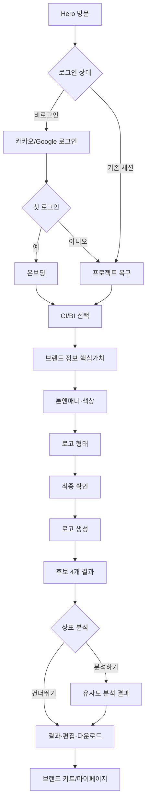

# GenMark AI 제품 요구사항 정의서(PRD)

> 버전: v1.0
> 작성 기준: 2026-08-05
> 제품: GenMark AI
> 문서 상태: 개발·디자인 협업용 초안
> 기준 문서: [DESIGN_SYSTEM.md](./DESIGN_SYSTEM.md), [API_SPEC.md](./API_SPEC.md), [SCREEN_COMPOSITION.md](./SCREEN_COMPOSITION.md)

## 1. 제품 개요

GenMark AI는 사용자가 브랜드 정보를 입력하면 AI가 로고 후보를 생성하고, 생성된 로고와 기존 상표 이미지의 시각적 유사도를 함께 검토할 수 있도록 돕는 브랜드 제작 서비스다.

핵심은 “예쁜 로고를 만들어주는 도구”에 머무르지 않고, **생성과 검토를 한 번에 제공하는 전문적이고 친근한 브랜드 파트너**가 되는 것이다.

### 1.1 제품 한 문장

> GenMark-AI는 감각적인 로고 제작 경험과 신뢰할 수 있는 상표 이미지 유사도 분석을 함께 제공하는, 전문적이고 친근한 브랜드 제작 서비스다.

### 1.2 Hero와 앱의 제품 역할

- Hero: 서비스의 첫인상, 가치 제안, 시작 유도
- 앱: 로그인 후 사용자가 실제로 브랜드를 입력·생성·검토·수정하는 작업 공간
- Hero의 이미지 갤러리와 스크롤 연출은 유지한다.
- Hero를 제외한 모든 화면은 앱 쉘(헤더, 작업 콘텐츠, 상태 피드백, 내비게이션)을 사용한다.

## 2. 문제 정의

초기 브랜드를 만드는 사용자는 다음 문제를 동시에 겪는다.

1. 로고 제작을 어디서부터 시작해야 할지 모른다.
2. 디자인 용어와 브랜드 전략 용어가 어렵게 느껴진다.
3. 생성된 로고가 마음에 들어도 기존 상표와 비슷한지 판단하기 어렵다.
4. 생성 도구와 상표 검토 도구가 분리되어 작업이 끊긴다.
5. 작업 중 이탈하거나 새로고침하면 입력 내용과 진행 단계가 사라질 수 있다.

GenMark AI는 질문을 단계적으로 단순화하고, 결과물과 검토 정보를 한 흐름으로 연결해 이 문제를 해결한다.

## 3. 목표와 성공 기준

### 3.1 제품 목표

- 초보 사용자도 5~10분 안에 로고 생성 플로우를 시작할 수 있게 한다.
- 사용자가 입력한 브랜드 맥락이 로고 후보 생성 결과에 반영되게 한다.
- 로고 생성과 상표 이미지 유사도 검토를 하나의 프로젝트 안에서 이어지게 한다.
- 생성·분석·수정 과정의 상태를 사용자가 이해할 수 있게 한다.
- 새로고침·재접속 후에도 마지막 프로젝트와 단계를 복구한다.

### 3.2 MVP 성공 지표

| 지표 | 목표 방향 | 측정 시점 |
| --- | --- | --- |
| Hero → 로그인/시작 전환율 | 지속적인 상승 | 주간 |
| 로그인 → 프로젝트 생성 완료율 | 80% 이상 목표 | 주간 |
| 프로젝트 생성 → 후보 결과 도달률 | 70% 이상 목표 | 주간 |
| 후보 결과 → 후보 선택률 | 50% 이상 목표 | 주간 |
| 상표 분석 선택률 | 퍼널 기준 측정 | 주간 |
| 생성/분석 실패 후 재시도율 | 실패 원인별 측정 | 주간 |
| 새로고침 후 프로젝트 복구 성공률 | 99%에 가깝게 유지 | 일간 |
| 오류·도움말 관련 이탈률 | 감소 | 주간 |

수치는 초기 운영 데이터로 보정한다. 법적 판단 정확도나 생성 품질을 단일 숫자로 과장하지 않는다.

## 4. 타깃 사용자

### 4.1 주요 사용자

- 온라인 쇼핑몰을 시작하려는 예비 창업자
- 개인 브랜드·사이드 프로젝트를 운영하는 1인 사업자
- SNS와 제품 썸네일에 사용할 로고가 필요한 크리에이터
- CI/BI를 처음 검토하는 소규모 회사 담당자

### 4.2 사용자 특성

- 전문 디자인·상표 지식이 부족하다.
- 결과는 빠르게 보고 싶지만, 선택의 근거도 필요하다.
- 어려운 용어보다 쉬운 설명과 예시를 선호한다.
- 작업 결과를 저장하고 나중에 이어서 수정해야 한다.

### 4.3 대표 사용자 스토리

> 온라인 화장품 브랜드를 준비하는 사용자로서, 브랜드의 느낌과 사용처를 간단히 입력하고 여러 로고 후보를 비교한 뒤, 비슷한 상표 이미지가 있는지 확인하고 싶다.

## 5. 제품 원칙

1. **어렵지 않게**: 전문 용어 대신 쉬운 질문과 예시를 사용한다.
2. **안심되게**: 진행 상태, 저장 상태, 분석의 한계를 명확하게 보여준다.
3. **정돈되게**: 화면마다 핵심 질문과 주요 행동을 하나로 제한한다.
4. **결과물 우선**: UI 장식보다 사용자가 만든 로고를 더 크게 보여준다.
5. **창의성과 신뢰의 균형**: 생성 경험은 감각적으로, 분석 경험은 객관적으로 설계한다.
6. **상태를 숨기지 않기**: loading, error, empty, success를 모두 제품 경험으로 다룬다.

## 6. 사용자 여정



## 7. 기능 범위

### 7.1 MVP 포함 범위

- Hero에서 로그인 또는 서비스 시작 진입
- 카카오·Google OAuth 로그인
- 첫 로그인 온보딩과 기존 사용자 프로젝트 복구
- 프로젝트 생성·저장·재조회
- CI/BI 선택
- 브랜드명, 회사명/모토, 사용처, 타깃, 핵심가치, 브랜드 설명 입력
- 톤앤매너와 색상 선택 또는 직접 색상 입력
- 로고 형태 선택
- 최종 요청 검토 및 로고 생성 시작
- 로고 후보 4개 조회·비교·선택·저장
- 상표 이미지 유사도 분석 선택·진행·요약 결과
- 선택 로고의 색상·글씨체·심볼 수정
- PNG/SVG 다운로드 URL 발급
- 마이페이지에서 진행 중/완료 프로젝트 확인
- 만족도 설문 제출

### 7.2 후속 범위

- 상세 상표 분석 전용 화면과 필터
- 브랜드 키트 전체 파일 묶음 생성
- 프로젝트 이름 변경·복제·삭제
- 팀 공유와 협업 권한
- 결제·구독·크레딧 정책의 실제 연동
- 로고 후보를 기반으로 한 명함·패키지·SNS 이미지 생성

### 7.3 범위 제외

- 상표 등록 가능 여부에 대한 법률 판단
- 상표 출원 대행
- 생성 결과의 무조건적인 독창성·등록 가능성 보장
- 사용자가 업로드한 타인의 권리 침해 여부에 대한 법적 판정

## 8. 화면 요구사항

모든 화면은 앱 쉘을 사용한다. 화면명은 현재 `App.tsx`의 `ViewMode`와 연결한다.

| 화면 | 핵심 목적 | 필수 상태 |
| --- | --- | --- |
| `login` | 인증 및 세션 시작 | 기본, SDK 오류, 네트워크 오류, loading |
| `onboarding` | 사용처·대상 파악 | 1단계, 2단계, 선택 오류 |
| `choice` | CI/BI 선택 | 미선택, 선택, 저장 중 |
| `brand-details` / `company-details` | 브랜드 맥락 수집 | 기본, 입력 오류, 저장 중 |
| `tone` | 인상과 색상 선택 | 기본, 직접 색상 입력, 저장 중 |
| `style` | 로고 형태 선택 | 기본, 추천, 미선택 오류 |
| `final` | 생성 전 검토 | 요약, 수정 이동, 저장 중 |
| `loading` | 로고 후보 생성 진행 | 진행 중, 완료, 실패, 재시도 |
| `trademark-selection` | 분석 여부 결정 | 분석하기, 건너뛰기, 안내 |
| `trademark-loading` | 상표 유사도 분석 진행 | 진행 중, 완료, 실패 |
| `trademark-result` | 유사도 결과 이해 | 안전, 주의, 위험, 데이터 없음 |
| `result` | 후보 비교·선택 | 후보 4개, 선택, 다운로드 오류 |
| `edit` | 후보 수정·적용 | 편집 중, 미리보기 생성 중, 적용 완료 |
| `mypage` | 프로젝트 복구·관리 | 진행 중, 완료 목록, 빈 상태 |
| `survey` | 피드백 수집 | 입력 전, validation, 제출 완료 |

## 9. 상세 기능 요구사항

### FR-01 인증

- 사용자는 카카오 또는 Google을 선택해 로그인할 수 있어야 한다.
- 프론트는 provider token을 백엔드 `POST /api/v1/auth/login`으로 전달한다.
- 백엔드가 반환한 GenMark access token은 메모리에, refresh token은 현재 정책에 맞는 저장소에 보관한다.
- access token 만료 시 `/auth/refresh`를 통해 한 번 재시도한다.
- 로그아웃 시 `/auth/logout`을 호출하고 로컬 인증 상태를 제거한다.
- `isFirstLogin=true`면 온보딩으로, 기존 프로젝트가 있으면 `resumeProjectId` 기준으로 복구한다.

### FR-02 프로젝트 생성·복구

- 로고 생성 플로우 시작 시 `POST /api/v1/projects`로 프로젝트를 생성한다.
- 모든 단계 저장 성공 응답의 `project.status`를 화면 결정 기준으로 사용한다.
- 새로고침·재접속 시 `GET /api/v1/projects/{projectId}`로 마지막 상태와 입력값을 복구한다.
- 프로젝트 소유자가 아닌 사용자는 프로젝트 데이터에 접근할 수 없어야 한다.

### FR-03 온보딩·브랜드 입력

- 사용처와 대상은 온보딩 단계에서 저장한다.
- CI/BI 선택은 `PATCH /projects/{projectId}`로 저장한다.
- 브랜드명·회사명·모토·핵심가치·브랜드 설명은 `/brand-brief`로 저장한다.
- 핵심가치는 최대 3개 선택을 기본 정책으로 한다.
- 필수 입력이 비어 있으면 해당 필드 가까이에 오류를 표시하고 다음 단계로 이동하지 않는다.

### FR-04 톤·색상·로고 형태

- 톤앤매너는 `/tone`으로 저장한다.
- AI 추천 색상과 직접 지정 색상을 구분해 저장한다.
- 직접 색상 입력은 유효한 HEX/RGB 형식인지 검증한다.
- 로고 형태는 `/logo-style`로 저장한다.
- 상표 분석 가능 여부는 선택된 로고 형태와 백엔드 정책을 함께 따른다.

### FR-05 로고 생성

- 최종 확인에서 `/final-review` 저장 후 `/logo-generations`를 호출한다.
- 생성 API는 비동기 작업 ID를 반환하며 프론트는 작업 상태를 조회한다.
- 권장 폴링 주기는 2초이며, `SUCCEEDED` 또는 `FAILED`에서 중지한다.
- 생성 중에는 중복 생성 요청을 막는다.
- 실패 시 원인 설명과 “다시 시도” 또는 “입력 수정”을 제공한다.

### FR-06 후보 결과

- 생성 완료 후 후보 4개를 조회한다.
- 사용자는 후보를 넘겨보고 하나를 선택하거나 저장할 수 있다.
- 선택 후보의 상세 정보에는 로고 이미지, 브랜드명, 스타일, 색상, 생성 근거를 포함한다.
- 다운로드는 백엔드가 발급한 파일 URL을 사용한다.

### FR-07 상표 이미지 유사도 분석

- 사용자는 분석 전 제공 가치와 법적 한계를 확인한다.
- 분석 선택 시 `/trademark-analyses`를 호출하고 진행 상태를 조회한다.
- 결과는 유사도 점수만 보여주지 않고 상태 의미, 유사 이유, 참고 목록을 함께 보여준다.
- 결과에는 항상 “시각적 유사성 참고 자료이며 법적 판단이 아님” 안내를 포함한다.
- 안전/주의/위험은 초록·주황·빨강을 아이콘과 텍스트와 함께 사용한다.

### FR-08 로고 편집

- 심볼, 텍스트, 배치를 구분해 편집할 수 있어야 한다.
- 편집안은 `/logo-edits`로 저장하고 필요 시 미리보기 작업을 생성한다.
- “수정 적용하기”는 `/logo-edits/{editId}/apply`를 호출한다.
- 적용 완료 후 결과 화면으로 돌아가며, 실패 시 편집 상태를 잃지 않는다.

### FR-09 마이페이지·설문

- 마이페이지는 진행 중 프로젝트와 완료 프로젝트를 구분한다.
- 진행 중 프로젝트는 마지막 저장 단계부터 이어갈 수 있어야 한다.
- 완료 프로젝트에서 결과, 상표 분석, 다운로드, 재생성, 브랜드 키트 진입을 제공한다.
- 설문은 평가, 개선 항목 복수 선택, 자유 의견을 저장한다.

## 10. 백엔드 연동 계약

기본 API prefix는 `/api/v1`이다. 개발 환경의 base URL은 환경 변수로 주입한다.

### 10.1 생성 플로우 API 순서

```text
POST   /auth/login
POST   /projects
PUT    /projects/{id}/onboarding
PATCH  /projects/{id}
PUT    /projects/{id}/brand-brief
PUT    /projects/{id}/tone
PUT    /projects/{id}/logo-style
PUT    /projects/{id}/final-review
POST   /projects/{id}/logo-generations
GET    /projects/{id}/logo-generations/{generationId}
GET    /projects/{id}/logo-generations/{generationId}/logo-candidates
POST   /projects/{id}/trademark-analyses
GET    /projects/{id}/trademark-analyses/{analysisId}
POST   /projects/{id}/logo-candidates/{candidateId}/select
POST   /projects/{id}/logo-edits
POST   /projects/{id}/logo-edits/{editId}/apply
```

### 10.2 프론트 구현 시 주의

- 화면의 임의 timeout을 실제 생성 완료 상태로 간주하지 않는다.
- `project.status`가 허용하는 다음 상태만 이동시킨다.
- 목업 후보·목업 상표 결과는 API 응답으로 교체할 수 있는 adapter를 둔다.
- 생성·분석·편집 적용 API에는 중복 요청 방지 키를 사용한다.
- `401`은 세션 복구 후 한 번만 재시도하고, 실패하면 로그인 화면으로 이동한다.

## 11. 프로젝트 상태 모델

| 상태 | 의미 | 허용되는 대표 화면 |
| --- | --- | --- |
| `DRAFT` | 프로젝트 생성 직후 | 온보딩, CI/BI |
| `STYLE_SELECTED` | 로고 형태 선택 완료 | 최종 확인 |
| `TRADEMARK_DECISION` | 분석 여부 선택 중 | 상표 분석 선택 |
| `GENERATING` | 로고 후보 생성 중 | 로고 생성 로딩 |
| `TRADEMARK_ANALYZING` | 상표 분석 중 | 상표 분석 로딩 |
| `RESULT_READY` | 후보 확인 가능 | 결과, 편집 |
| `EDITING` | 후보 편집 중 | 편집기 |

클라이언트는 상태를 직접 임의 변경하지 않고, API 성공 응답의 최신 프로젝트 상태를 저장한다.

## 12. 비기능 요구사항

### 12.1 접근성

- 본문 대비 4.5:1 이상, 큰 텍스트 3:1 이상
- 모든 버튼·아이콘의 키보드 접근과 visible focus
- 터치 영역 최소 44×44px
- 오류는 입력 가까이에 표시하고 `role="alert"` 사용
- 로딩·완료 상태는 `aria-live="polite"`로 전달
- 색상만으로 안전/주의/위험을 전달하지 않음
- `prefers-reduced-motion` 지원

### 12.2 성능

- 첫 화면의 Hero 이미지와 앱 화면의 결과 이미지를 지연 로딩한다.
- 이미지 영역은 고정 비율을 예약해 layout shift를 줄인다.
- 생성/분석 폴링은 2초 간격과 취소 처리를 사용한다.
- 후보 목록은 필요 이상으로 원본 이미지를 동시에 로드하지 않는다.

### 12.3 보안·신뢰

- 프로젝트·후보·편집 결과의 사용자 소유권을 백엔드에서 확인한다.
- refresh token을 로그·URL·분석 이벤트에 노출하지 않는다.
- 상표 분석 결과에는 참고용·비법률 판단 고지를 항상 포함한다.
- 생성·분석 API는 사용자/프로젝트별 rate limit과 중복 방지를 적용한다.

## 13. 분석 이벤트

이벤트명은 백엔드와 최종 합의한다.

| 이벤트 | 주요 속성 |
| --- | --- |
| `hero_cta_clicked` | `entry`, `isLoggedIn` |
| `auth_completed` | `provider`, `isFirstLogin` |
| `project_created` | `projectId` |
| `onboarding_completed` | `usage`, `audience` |
| `logo_generation_started` | `projectId`, `logoStyle` |
| `logo_generation_completed` | `candidateCount`, `durationMs` |
| `trademark_analysis_started` | `candidateId`, `entryPoint` |
| `trademark_analysis_completed` | `riskLevel`, `topSimilarity` |
| `candidate_selected` | `candidateId` |
| `logo_edit_applied` | `target`, `editCount` |
| `project_resumed` | `status` |
| `survey_submitted` | `rating`, `improvementCount` |

개인 식별 정보와 provider token은 이벤트 속성에 포함하지 않는다.

## 14. 완료 기준(Definition of Done)

### 제품 흐름

- [ ] 비로그인 사용자가 Hero에서 로그인으로 이동할 수 있다.
- [ ] 첫 로그인 사용자는 온보딩으로, 기존 사용자는 프로젝트를 복구한다.
- [ ] 각 단계의 입력값이 백엔드에 저장되고 새로고침 후 복구된다.
- [ ] 생성·분석 작업이 실제 상태와 동기화된다.
- [ ] 결과 후보를 선택·저장·다운로드할 수 있다.
- [ ] 편집 적용 후 결과가 갱신된다.
- [ ] 마이페이지에서 진행 중 프로젝트를 재개할 수 있다.

### 디자인·UX

- [ ] Hero를 제외한 화면이 앱 쉘을 사용한다.
- [ ] 화이트/밝은 회색 배경, 인디고/네이비 구조, 상태 색상 규칙을 지킨다.
- [ ] 사용자의 로고가 UI 장식보다 시각적으로 우선한다.
- [ ] 모든 화면에 loading/error/empty/success 상태가 정의되어 있다.
- [ ] 375px, 768px, 1024px, 1440px에서 레이아웃이 깨지지 않는다.
- [ ] 키보드와 screen reader로 핵심 플로우를 완료할 수 있다.

### 기술

- [ ] TypeScript 검사 통과
- [ ] API 오류·401·네트워크 단절 처리 확인
- [ ] 중복 생성/분석 요청 방지 확인
- [ ] 토큰과 개인정보가 로그·URL에 노출되지 않음
- [ ] 실제 백엔드 응답 기준 E2E 테스트 완료

## 15. 현재 구현과의 차이 및 후속 작업

현재 프론트는 화면 흐름 검증을 위해 일부 후보·결과·로딩 데이터를 로컬 목업으로 사용한다. PRD의 목표 상태에서는 다음 순서로 실제 데이터 연동을 진행한다.

1. 프로젝트 생성·상태 조회를 연결하고 `projectId`를 전역 작업 컨텍스트로 관리한다.
2. 온보딩부터 최종 검토까지 각 단계 저장 API를 연결한다.
3. 로고 생성과 상표 분석의 timeout 기반 전환을 비동기 작업 polling으로 교체한다.
4. 후보·상표 결과·편집 결과를 API 응답으로 교체한다.
5. 마이페이지를 프로젝트 목록/상세 API 기반으로 전환한다.
6. 각 상태와 오류를 실제 백엔드 코드에 맞춰 QA한다.

이 문서의 화면·문구·색상 원칙은 [DESIGN_SYSTEM.md](./DESIGN_SYSTEM.md)를 우선하며, API 필드와 상태는 [API_SPEC.md](./API_SPEC.md)를 우선한다.
