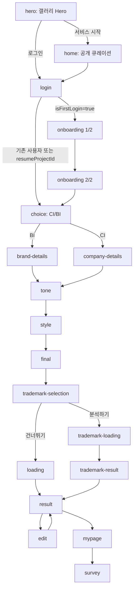

# GenMark AI 화면 구성도·데이터 연동 명세

> 버전: v1.0
> 기준: 현재 구현된 `src/App.tsx` 화면과 `docs/API_SPEC.md`
> 목적: 화면에 보이는 요소, 사용자 상호작용, 백엔드 송수신 값을 한 문서에서 공유
> 범위: Hero/Main, 로그인, 생성 플로우, 상표 분석, 결과, 편집, 마이페이지, 설문

## 1. 문서 원칙

이 문서는 새로운 화면이나 새로운 사용자 행동을 제안하지 않는다. 현재 구현된 화면의 구성과 상호작용을 기준으로, 목업 상태를 실제 백엔드 데이터와 연결하기 위한 매핑 문서다.

- 화면의 스타일·배치·문구·상호작용은 현재 구현을 기준으로 유지한다.
- 백엔드가 화면을 위해 내려주는 데이터는 기존 화면 요소에 주입한다.
- 기존 화면에 없는 기능을 임의로 추가하지 않는다.
- API 명세에 없는 데이터는 `미정/후속 API`로 표시한다.
- 프론트는 화면 전환을 임의로 결정하지 않고, API 성공 응답의 `project.status`를 우선한다.

## 2. 표기법

| 표기 | 의미 |
| --- | --- |
| `[UI]` | 화면에 표시되는 요소 |
| `↑` | 프론트에서 백엔드로 보내는 값/요청 |
| `↓` | 백엔드에서 프론트로 받는 값/응답 |
| `LOCAL` | 현재 프론트 로컬 상태 또는 localStorage |
| `MOCK` | 현재 화면에 하드코딩된 목업 값 |
| `PENDING API` | 현재 API_SPEC에 endpoint가 없어 후속 합의가 필요한 값 |

## 3. 전체 화면 흐름



## 4. 공통 앱 쉘

Hero(`hero`)를 제외한 화면은 앱 화면으로 취급한다.

```text
┌──────────────────────────────────────────┐
│ 앱 헤더: GenMark AI · 도움말 · 단계/계정  │  [UI]
├──────────────────────────────────────────┤
│ 뒤로가기                                  │  [UI]
│                                          │
│ 현재 단계 콘텐츠                          │  [UI]
│   입력 / 선택 / 결과 / 진행 상태           │  [UI]
│                                          │
│ 주요 CTA                                  │  [UI]
├──────────────────────────────────────────┤
│ 하단 nav: 홈 · 마이페이지                 │  [UI]
└──────────────────────────────────────────┘
```

- 로그인·생성 중·상표 분석 중·Hero에서는 하단 nav를 숨긴다.
- 앱 화면에서 헤더·뒤로가기·CTA 위치는 현재 구현을 유지한다.
- `loading`, `trademark-loading`은 backend 작업 상태를 표시하는 화면이므로 timeout만으로 완료 처리하지 않는다.

## 5. 화면별 구성 및 데이터 흐름

### 5.1 `hero` — 메인 Hero

```text
┌──────────────────────────────────────────┐
│ GenMark AI                              │ [UI]
│                              로그인      │ [UI]
│                                          │
│   갤러리/배경 효과                         │ [UI]
│   화장품 로고를 만들고 ... 확인하세요       │ [UI]
│   서비스 시작하기                          │ [UI]
│   디자인 경험이 없어도 ...                 │ [UI]
└──────────────────────────────────────────┘
```

| 구분 | 내용 |
| --- | --- |
| UI | 브랜드 로고, 로그인 버튼, Hero 문구, 서비스 시작 CTA, 이미지 갤러리 효과 |
| ↑ | 로그인 버튼: `login` 화면 이동. 서비스 시작: 현재 구현된 `home`/로그인 진입 흐름 실행 |
| ↓ | 없음. Hero 자체는 공개 소개 화면 |
| 현재 상태 | 배경/갤러리와 문구는 프론트 자산 및 컴포넌트 |
| 주의 | Hero의 시각 효과를 앱 화면에 복제하지 않는다. |

### 5.2 `home` — 공개 큐레이션/메인

```text
┌──────────────────────────────────────────┐
│ 대표 큐레이션 Hero                         │ [UI]
│ 필터: 전체 · 워드마크 · 콤비네이션 ...      │ [UI]
│ 큐레이션 갤러리  ← 카드 →                  │ [UI]
│ 카드: 이미지 · 이름 · 메타 · 좋아요         │ [UI]
└──────────────────────────────────────────┘
```

| 구분 | 내용 |
| --- | --- |
| UI | 대표 이미지, 카테고리 필터, 갤러리 좌우 이동, 좋아요 버튼, 서비스 시작 버튼 |
| ↑ | 현재 좋아요는 `likedIds` LOCAL. 공개 갤러리 API와 좋아요 저장 API는 API_SPEC에 없음 |
| ↓ | 현재 `galleryItems` MOCK. 공개 큐레이션 API를 연결할 경우 카드 목록·카테고리·좋아요 수를 받음 |
| 주의 | 공개 갤러리 API를 새로 구현하기 전에는 현재 목업 구조와 화면을 유지한다. |

### 5.3 `login` — 로그인

```text
┌──────────────────────────────────────────┐
│ ← 홈                         로그인 상태   │ [UI]
│                                          │
│              GenMark AI                  │ [UI]
│              스탬프 이미지                │ [UI]
│        만들던 브랜드를 안전하게 저장       │ [UI]
│ [ 카카오로 계속하기 ]                      │ [UI]
│ [ Google로 계속하기 ]                      │ [UI]
│ 약관/개인정보 안내 · 나중에 할게요          │ [UI]
│ 오류/로딩 메시지                           │ [UI]
└──────────────────────────────────────────┘
```

| UI 요소 | 상호작용 및 데이터 |
| --- | --- |
| 카카오 버튼 | ↑ SDK provider token → `POST /api/v1/auth/login` `{ provider: "kakao", idToken, redirectUri }` |
| Google 버튼 | ↑ SDK provider token → `POST /api/v1/auth/login` `{ provider: "google", idToken, redirectUri }` |
| 로그인 결과 | ↓ `accessToken`, `refreshToken`, `expiresIn`, `user`, `resumeProjectId` |
| 첫 로그인 분기 | ↓ `user.isFirstLogin=true` → `onboarding`; false → `resumeProjectId` 복구 또는 `choice` |
| 새로고침 | ↓ refresh token으로 `/auth/refresh` 후 `/me` 호출 |
| 로그아웃 | ↑ `POST /auth/logout` `{ refreshToken }` |
| 오류 | `AuthError`를 provider 버튼 위 인라인 alert로 표시 |

### 5.4 `onboarding` — 1/2 사용처, 2/2 방문 계기

```text
┌──────────────────────────────────────────┐
│ ← 로그인          GenMark AI       1 / 2 │ [UI]
│ 로고를 어디에 사용할 예정인가요?           │ [UI]
│ [온라인 쇼핑몰] [SNS] [오프라인]           │ [UI]
│                                          │
│ ← 이전                              2 / 2 │ [UI]
│ 어떤 계기로 방문하게 되셨나요?             │ [UI]
│ [회사/팀] [자영업] [취미/창작] [부업]       │ [UI]
│                         다음/시작하기      │ [UI]
└──────────────────────────────────────────┘
```

| 단계 | UI 값 | ↑ 저장 대상 | ↓ 응답/화면 결정 |
| --- | --- | --- | --- |
| 1/2 | `onboardingSelection[]` (`online`, `social`, `offline`) | `PUT /projects/{id}/onboarding` 사용처 | `project.status`, 저장된 onboarding |
| 2/2 | `audienceSelection` (`company`, `owner`, `hobby`, `sidejob`) | 동일 onboarding payload의 방문 계기/대상 필드 | `project.status`, 다음 단계 |

- 현재 선택값은 `useState` LOCAL이며, 실제 저장 시점은 “다음/시작하기” 클릭으로 유지한다.
- 선택 상태 UI는 `aria-pressed`로 제공한다.
- 빈 선택 허용 여부는 API_SPEC의 validation과 일치시킨다.

### 5.5 `choice` — CI / BI 선택

```text
┌──────────────────────────────────────────┐
│ ← 온보딩                                  │ [UI]
│                                          │
│ [CI 카드]                                  │
│ 회사·기업 로고 / 추천 상황 / 결과물         │ [UI]
│ 회사 로고 만들기                            │ [UI]
│                                          │
│ [BI 카드]                                  │
│ 제품·브랜드 로고 / 추천 상황 / 결과물        │ [UI]
│ 제품·브랜드 로고 만들기                     │ [UI]
│ 편집 · 공유                                │ [UI]
└──────────────────────────────────────────┘
```

| 구분 | 내용 |
| --- | --- |
| ↑ | 카드 선택값 `brandKind: "ci" | "bi"` → `PATCH /projects/{projectId}` |
| ↓ | `project.brandKind`, 최신 `project.status` |
| 화면 분기 | `ci` → `company-details`, `bi` → `brand-details` |
| LOCAL | `brandKind`, 선택 화면 공유 버튼 상태 |

### 5.6 `brand-details` — BI 브랜드 정보

```text
┌──────────────────────────────────────────┐
│ 2 / 4 진행 표시                            │ [UI]
│ 어떤 화장품 브랜드를 만들고 있나요?         │ [UI]
│                                          │
│ 상호명                                     │ [UI]
│ [브랜드명 입력................] 0 / 80      │ [UI]
│                                          │
│ 브랜드가 추구하는 가치 (최대 3개)           │ [UI]
│ [카테고리] [직접입력]                       │ [UI]
│ [비건] [저자극] [클린뷰티] ...              │ [UI]
│ 또는 가치 설명 textarea                     │ [UI]
│                              다음          │ [UI]
└──────────────────────────────────────────┘
```

| UI 값 | 프론트 상태 | ↑ API | ↓ 사용 |
| --- | --- | --- | --- |
| 상호명 | `brandName` | `PUT /projects/{id}/brand-brief` `brandName` | 최종 요약·생성 입력 |
| 카테고리 가치 | `coreValues[]` 최대 3개 | `coreValues` | 생성 프롬프트·요약 |
| 직접 입력 가치 | `brandValueDescription` | `brandValueDescription` | 생성 프롬프트·요약 |
| 진행 표시 | 파생 UI | 없음 | 최신 `project.status`와 함께 갱신 |

- 현재 화면의 BI 예시 문구와 일러스트는 UI 자산이다.
- 현재 `brandName`, `coreValues`, `brandValueDescription`은 LOCAL이므로 저장 API adapter로 교체한다.

### 5.7 `company-details` — CI 기업 정보

```text
┌──────────────────────────────────────────┐
│ 2 / 4 진행 표시                            │ [UI]
│ 어떤 기업을 만들고 있나요?                 │ [UI]
│ 기업명 [입력.....................] 0 / 80   │ [UI]
│ 기업의 모토                                │ [UI]
│ [미션/비전/모토 textarea........] 0 / 300   │ [UI]
│                              다음          │ [UI]
└──────────────────────────────────────────┘
```

| UI 값 | 프론트 상태 | ↑ API 후보 | ↓ 사용 |
| --- | --- | --- | --- |
| 기업명 | `companyName` | `PUT /projects/{id}/brand-brief` 또는 API_SPEC의 CI 기본 정보 필드 | 최종 요약·생성 입력 |
| 기업 모토 | `companyMotto` | 동일 brand brief payload | 생성 프롬프트·요약 |
| 완료 플래그 | `genmark-onboarding-completed` LOCAL | 백엔드에는 프로젝트 상태로 저장 | 재진입 시 choice 복구 |

현재 기업명·모토는 localStorage에도 저장되지만, 백엔드 연동 후 서버 응답을 source of truth로 사용한다.

### 5.8 `tone` — 톤앤매너·색상

```text
┌──────────────────────────────────────────┐
│ 3 / 4 진행 표시                            │ [UI]
│ 톤앤매너와 색상을 골라주세요               │ [UI]
│ [친근] [전문] [따뜻] [트렌디] [미니멀]       │ [UI]
│                                          │
│ 직접 색상 지정                             │ [UI]
│ [색상 스와치] 직접                          │ [UI]
│   RGB picker / R G B 입력 / 선택 완료       │ [UI]
│                              다음          │ [UI]
└──────────────────────────────────────────┘
```

| UI 값 | 프론트 상태 | ↑ API | ↓ 사용 |
| --- | --- | --- | --- |
| 톤 선택 | `toneSelection` | `PUT /projects/{id}/tone` `tone` | 생성 프롬프트·최종 요약 |
| 직접 색상 | `manualColor { r,g,b }` | `manualColors` 또는 확정된 색상 필드 | 후보 색상 생성 |
| 색상 picker 열림 | `colorPickerOpen` LOCAL | 없음 | UI 표시만 제어 |

### 5.9 `style` — 로고 형태

```text
┌──────────────────────────────────────────┐
│ 3 / 4 진행 표시                            │ [UI]
│ 어떤 형태의 로고가 필요한가요?             │ [UI]
│ [심볼마크 프리뷰] 설명                      │ [UI]
│ [워드마크 프리뷰] 설명                      │ [UI]
│ [콤비네이션 프리뷰] 추천                    │ [UI]
│ [레터마크 프리뷰] 설명                      │ [UI]
│                              다음          │ [UI]
└──────────────────────────────────────────┘
```

| 구분 | 내용 |
| --- | --- |
| ↑ | `logoStyle: "symbol" | "wordmark" | "combination" | "lettermark"` → `PUT /projects/{id}/logo-style` |
| ↓ | 저장된 `logoStyle`, `project.status` |
| 파생 | `combination` 또는 `symbol`인 경우 상표 분석 진입 가능 |
| LOCAL | 카드 선택 UI는 `logoStyle` state로 유지 |

### 5.10 `final` — 최종 요청 및 생성 전 확인

```text
┌──────────────────────────────────────────┐
│ 4 / 4 진행 표시                            │ [UI]
│ 마지막으로 꼭 반영할 내용을 알려주세요      │ [UI]
│ 추가 요청 textarea · 0 / 300               │ [UI]
│ 도움말 chips: 넣고 싶은/피하고 싶은 요소    │ [UI]
│                                          │
│ 이 내용으로 로고를 만들게요                 │ [UI]
│ 브랜드명 · 제품 종류 · 설명 · 고객 · 가치   │ [UI]
│ 톤 · 색상 · 로고 형태 · 추가 요청           │ [UI]
│ 각 행 수정하기                              │ [UI]
│                         로고 생성하기       │ [UI]
└──────────────────────────────────────────┘
```

| UI 값 | 현재 상태 | ↑ API | ↓ 사용 |
| --- | --- | --- | --- |
| 추가 요청 | `additionalRequest` | `PUT /projects/{id}/final-review` | 생성 요청 |
| 요약 행 | 일부 `summaryRows` MOCK | 프로젝트 상세/각 단계 저장 응답으로 대체 | 화면 표시 |
| 최종 생성 CTA | `canAnalyzeTrademark`에 따라 분기 | `/final-review` 성공 후 상표 선택 또는 `/logo-generations` | 다음 화면 |

현재 `summaryRows`의 브랜드명·제품 종류·설명·고객·가치·색상 일부는 목업이다. 디자인/배치를 바꾸지 않고, 동일 위치에 저장된 project 값을 주입한다.

### 5.11 `loading` — 로고 후보 생성

```text
┌──────────────────────────────────────────┐
│ 브랜드 정보를 바탕으로 로고를 만들고 있어요 │ [UI]
│ 서로 다른 방향의 후보 4개 준비             │ [UI]
│ 생성 오브 / 로딩 상태                       │ [UI]
│ 1 특징 정리        진행/완료                │ [UI]
│ 2 분위기 탐색      대기                     │ [UI]
│ 3 색상·글씨체      대기                     │ [UI]
│ 4 후보 생성        대기                     │ [UI]
│ 5 결과 정리        대기                     │ [UI]
└──────────────────────────────────────────┘
```

| 시점 | 요청/응답 |
| --- | --- |
| 진입 전 | ↑ `POST /projects/{id}/logo-generations` (최종 review 저장 완료 후) |
| 진입 응답 | ↓ `generationId`, `project.status=GENERATING` |
| 화면 유지 | ↓ `GET /projects/{id}/logo-generations/{generationId}` 폴링(권장 2초) |
| 완료 | ↓ `SUCCEEDED`, `progress`, `steps`, `project.status=RESULT_READY` → `result` |
| 실패 | ↓ `FAILED`, `errorCode`, `message` → 오류/재시도 UI |

현재 구현의 1.7초 timeout 전환은 목업 동작이다. 실제 연동 시 서버 작업 상태를 사용한다.

### 5.12 `trademark-selection` — 상표 분석 선택

```text
┌──────────────────────────────────────────┐
│ ← 이전                                    │ [UI]
│ 상표 이미지 유사도를 확인해볼까요?         │ [UI]
│ 혜택 1: 기존 이미지 비교                   │ [UI]
│ 혜택 2: 유사도와 근거 확인                  │ [UI]
│ 혜택 3: 제작 후 검토                        │ [UI]
│ [비슷한 상표 이미지 확인하기]              │ [UI]
│ [지금은 건너뛰기]                           │ [UI]
│ 참고용/비법률 판단 고지                     │ [UI]
└──────────────────────────────────────────┘
```

| 상호작용 | ↑ | ↓ |
| --- | --- | --- |
| 분석하기 | `POST /projects/{id}/trademark-analyses` `{ candidateId }` | `analysisId`, `project.status=TRADEMARK_ANALYZING` |
| 건너뛰기 | API_SPEC 기준 project decision 저장 방식 확정 필요. 현재는 생성으로 이동하는 LOCAL 흐름 | `project.status=GENERATING` |
| 뒤로가기 | 네트워크 요청 없음 | `trademarkEntry` LOCAL에 따라 `final` 또는 `result` |

### 5.13 `trademark-loading` — 상표 분석 진행

```text
┌──────────────────────────────────────────┐
│ 상표 이미지 유사도를 분석하고 있어요       │ [UI]
│ 로고 특징 추출                             │ [UI]
│ 비슷한 도형/구도 검색                       │ [UI]
│ 유사 상표와 점수 정리                       │ [UI]
│ 완료/진행/대기 상태                         │ [UI]
└──────────────────────────────────────────┘
```

| 구분 | 내용 |
| --- | --- |
| ↑ | 별도 입력 없이 analysis 작업 조회 |
| ↓ | `GET /projects/{id}/trademark-analyses/{analysisId}` → `steps`, `status`, `resultSummary`, `disclaimer` |
| 완료 | `project.status`와 analysis 상태가 완료되면 `trademark-result` 또는 현재 구현된 결과 연결 |
| 실패 | `TRADEMARK_ANALYSIS_FAILED`, 분석 건너뛰고 결과로 이동 가능한 안내 |

### 5.14 `trademark-result` — 상표 이미지 유사도 결과

```text
┌──────────────────────────────────────────┐
│ ← 로고 결과                               │ [UI]
│ 분석 완료                                 │ [UI]
│ 현재 로고의 유사도 결과                    │ [UI]
│ 상태: 안전/주의/위험 · 점수                │ [UI]
│ 유사 결과 목록                             │ [UI]
│ 순위 · 썸네일 · 브랜드명 · 유사 이유        │ [UI]
│ 법적 판단 아님 고지                         │ [UI]
│ 로고 결과로 돌아가기                       │ [UI]
└──────────────────────────────────────────┘
```

| UI 요소 | ↓ API |
| --- | --- |
| 요약 상태·점수 | `GET /projects/{id}/trademark-analyses/{analysisId}`의 `resultSummary` |
| 유사 상표 목록 | `GET /projects/{id}/trademark-analyses/{analysisId}/matches` |
| disclaimer | analysis 응답의 고지 문구 |
| 결과로 돌아가기 | 네트워크 요청 없음. `result` 화면 이동 |

현재 화면의 일부 점수·상태·목록은 MOCK이므로 동일한 컴포넌트 위치에 API 응답을 연결한다.

### 5.15 `result` — 로고 후보 결과

```text
┌──────────────────────────────────────────┐
│ GenMark AI                         도움말 │ [UI]
│ 생성 완료 · 후보 1 / 4                    │ [UI]
│         로고 프리뷰 캔버스                 │ [UI]
│     ← 후보 이동      후보 이동 →           │ [UI]
│       ● ○ ○ ○                             │ [UI]
│ 브랜드명 · 스타일 · 색상 · 분위기          │ [UI]
│ 상표 유사도 요약                           │ [UI]
│ [브랜드 키트 만들기]                        │ [UI]
│ [색상 · 글씨체 수정]                        │ [UI]
│ [다운로드] [상표 결과] [다시 생성]          │ [UI]
└──────────────────────────────────────────┘
```

| 상호작용/요소 | ↑/↓ 데이터 |
| --- | --- |
| 후보 목록 | ↓ `GET /projects/{id}/logo-candidates` → 최대 4개 후보 |
| 후보 이동 | 현재 `resultCandidate` LOCAL. 이미 받은 후보 배열 안에서 이동 |
| 후보 선택 | ↑ `POST /projects/{id}/logo-candidates/{candidateId}/select` |
| 좋아요/저장 | ↑ `POST /projects/{id}/logo-candidates/{candidateId}/save` `{ saved: boolean }` |
| 다운로드 | ↑ `GET /projects/{id}/assets/{assetId}/download` → 다운로드 URL |
| 상표 영역 | ↓ 분석 summary가 있으면 표시, 없으면 분석 선택 진입 |
| 편집 | 네트워크 요청 없이 `edit` 진입 후 편집 저장 |

현재 후보 배열, 좋아요, 일부 상세 설명은 MOCK/LOCAL이다. 결과 화면의 구조는 유지하고 후보·상태·URL만 API 응답으로 교체한다.

### 5.16 `edit` — 로고 편집기

```text
┌──────────────────────────────────────────┐
│ ← 결과   GenMark AI                 저장  │ [UI]
│ 후보 1 / 4                                │ [UI]
│                                          │
│              로고 artboard                 │ [UI]
│        심볼 선택 / 글자 선택               │ [UI]
│                                          │
│ [심볼] [글자] [배치]                        │ [UI]
│ 글자: 브랜드명 input                        │ [UI]
│ 글꼴 · 크기 · 자간 · 색상                  │ [UI]
│ 심볼: 종류 · 크기 · 회전 · 색상 · 투명도    │ [UI]
│ [심볼 다시 생성하기]                        │ [UI]
│ [수정 적용하기]                             │ [UI]
│ [상표 이미지 유사도 다시 확인하기]           │ [UI]
└──────────────────────────────────────────┘
```

| UI 값 | 현재 상태 | ↑ API | ↓ 응답 |
| --- | --- | --- | --- |
| 편집 대상 | `editTarget` (`symbol`, `text`) | `POST /projects/{id}/logo-edits` `target` | `editId`, edit 상태 |
| 글자 | `editorBrandName`, `editorScale`, `editorLetterSpacing`, `editorColor` | edit payload | 편집안 저장 |
| 심볼 | `editorSymbol`, `editorScale`, `editorRotation`, `editorOpacity`, `editorColor` | edit payload | 편집안 저장 |
| 미리보기 | 편집 입력 변경 | `POST /projects/{id}/logo-edits/{editId}/preview` | preview asset/status |
| 적용 | `editorSaved` LOCAL | `POST /projects/{id}/logo-edits/{editId}/apply` | 갱신된 candidate/project |
| 재분석 | 현재 선택 candidate | `POST /projects/{id}/trademark-analyses` | `analysisId` |

현재 editor 값은 LOCAL이며 실제 preview/apply 성공 응답을 받은 뒤에만 `result`로 이동한다.

### 5.17 `mypage` — 프로젝트 보관함

```text
┌──────────────────────────────────────────┐
│ GenMark AI                         도움말 │ [UI]
│ 마이페이지                                 │ [UI]
│ 사용자님의 브랜드 작업                    │ [UI]
│                                          │
│ 이어서 만들기                              │ [UI]
│ 프로젝트 썸네일 · 현재 단계 · 이어서 작성  │ [UI]
│                                          │
│ 완성된 브랜드                              │ [UI]
│ 썸네일 · 상태 · 완료 항목                  │ [UI]
│ 결과 / 상표 결과 / 다운로드 / 재생성       │ [UI]
│ 서비스 피드백                              │ [UI]
└──────────────────────────────────────────┘
```

| UI 요소 | ↑/↓ 데이터 |
| --- | --- |
| 사용자 이름 | ↓ `/me`의 `user` |
| 이어서 만들기 | ↓ `/me.resumeProjectId` → `GET /projects/{id}` |
| 프로젝트 목록 | ↓ `GET /projects` |
| 프로젝트 상태 | ↓ `project.status`, `updatedAt`, progress/완료 정보 |
| 결과 보기 | project/candidate ID로 `result` 진입 |
| 다운로드 | asset ID로 download URL 발급 |
| 설문 진입 | 현재는 `survey` 화면 이동. 제출 endpoint는 PENDING API |

현재 완료 프로젝트 1개와 일부 상태는 MOCK이다. 카드 구성은 유지하고 목록/상태/액션 대상만 API 데이터로 대체한다.

### 5.18 `survey` — 만족도 설문

```text
┌──────────────────────────────────────────┐
│ ← 마이페이지       GenMark AI   만족도 평가 │ [UI]
│ 로고를 만드는 과정은 어떠셨나요?           │ [UI]
│ [좋아요] [싫어요]                           │ [UI]
│ 개선 희망 항목 chips                        │ [UI]
│ 추가 의견 textarea · 0 / 500                │ [UI]
│ 의견 보내기                                │ [UI]
│ 제출 완료: 감사 문구 · 마이페이지           │ [UI]
└──────────────────────────────────────────┘
```

| UI 값 | 현재 상태 | 백엔드 상태 |
| --- | --- | --- |
| 만족도 | `surveyRating` (`5` 또는 `1`) LOCAL | API_SPEC에 설문 endpoint 없음 — PENDING API |
| 개선 항목 | `surveyImprovements[]` LOCAL | PENDING API |
| 추가 의견 | `surveyComment` LOCAL | PENDING API |
| 제출 완료 | `surveySubmitted` LOCAL | API 성공 응답으로 전환 필요 |

설문 endpoint가 확정되기 전까지 화면 디자인·상호작용은 변경하지 않는다.

### 5.19 크레딧·다운로드 모달

현재 `result`에서 다운로드를 누르면 크레딧 안내 모달과 설문 참여 모달이 열린다.

| UI 요소 | 현재 상태 | 백엔드 확인 필요 |
| --- | --- | --- |
| 남은 크레딧 | `remainingCredits` LOCAL | 사용자 크레딧 조회 endpoint |
| 크레딧 차감 | `downloadWithCredit()` LOCAL | 다운로드 권한/차감 API |
| 설문 보상 | `submitCreditSurvey()` LOCAL | 설문 제출·크레딧 보상 API |
| 다운로드 | 현재 브라우저 SVG 생성 | 실제 asset download URL API |

이 영역은 현재 API_SPEC의 프로젝트/로고 API 범위 밖이므로, 백엔드 계약 확정 전에는 기존 UI만 유지한다.

## 6. 데이터 소유권과 저장 기준

| 데이터 | 현재 프론트 | 목표 source of truth |
| --- | --- | --- |
| 인증 토큰 | `auth.ts` 메모리/localStorage | 백엔드 auth 응답 + auth module |
| 온보딩 선택 | React state | project onboarding 응답 |
| CI/BI | React state | project |
| 브랜드명/기업명/모토 | React state, 일부 localStorage | project brand brief |
| 핵심가치 | React state | project brand brief |
| 톤/색상 | React state | project tone |
| 로고 형태 | React state | project logo style |
| 추가 요청 | React state | project final review |
| 생성 진행 | 화면 timeout | generation API status |
| 후보 4개 | MOCK | logo-candidates API |
| 상표 결과 | MOCK | trademark analysis API |
| 편집값 | React state | logo edit/preview/apply API |
| 프로젝트 목록 | MOCK | projects API |
| 설문/크레딧 | LOCAL | 후속 API 확정 후 전환 |

## 7. 백엔드 응답을 화면에 반영하는 공통 규칙

1. API 성공 응답의 `project`를 현재 project context에 저장한다.
2. `project.status`가 변경되면 그 상태가 허용하는 화면으로 이동한다.
3. API 응답에 없는 값은 기존 UI의 empty/placeholder 상태로 표시한다.
4. `401`은 refresh 후 원 요청을 한 번만 재시도한다.
5. `202` 비동기 응답은 작업 ID를 저장하고 화면을 유지한 채 polling한다.
6. `FAILED` 응답은 사용자가 재시도하거나 이전 입력으로 돌아갈 수 있게 한다.
7. 서버 오류 메시지는 그대로 노출하지 않고, 화면의 기존 문구 톤에 맞춘 쉬운 안내로 매핑한다.

## 8. 구현 시 변경 금지 범위

- 화면의 레이아웃, 카드 순서, 주요 CTA 위치를 API 연동을 이유로 변경하지 않는다.
- 현재 사용자가 선택할 수 있는 항목 수와 화면 간 이동 순서를 임의로 변경하지 않는다.
- 목업 데이터를 API로 교체할 때 CSS class와 컴포넌트 구조를 우선 유지한다.
- 서버 상태가 추가로 필요하더라도 기존 화면의 상태 영역 안에 표시한다.
- API endpoint가 없는 설문·크레딧·공개 갤러리 기능은 별도 합의 전까지 목업/LOCAL 동작을 유지한다.

## 9. 연동 완료 체크리스트

### 화면·UI

- [ ] 현재 구현된 모든 `ViewMode`가 화면 구성도에 매핑되어 있다.
- [ ] Hero를 제외한 화면이 앱 쉘 규칙을 유지한다.
- [ ] API 응답을 주입해도 기존 디자인과 상호작용 배치가 변하지 않는다.
- [ ] loading/error/empty/success 상태가 기존 상태 영역에 표시된다.

### 데이터

- [ ] 로그인 응답으로 첫 로그인/복구 프로젝트가 분기된다.
- [ ] 온보딩부터 최종 확인까지 단계별 저장값이 프로젝트에 남는다.
- [ ] 생성·분석은 timeout이 아닌 작업 상태 polling으로 전환된다.
- [ ] 후보·상표 결과·편집 결과가 목업이 아닌 API 응답으로 표시된다.
- [ ] 새로고침 후 `GET /projects/{id}` 기준으로 화면과 입력값이 복구된다.
- [ ] 미정 API(설문·크레딧·공개 갤러리)의 담당자와 endpoint가 결정된다.
